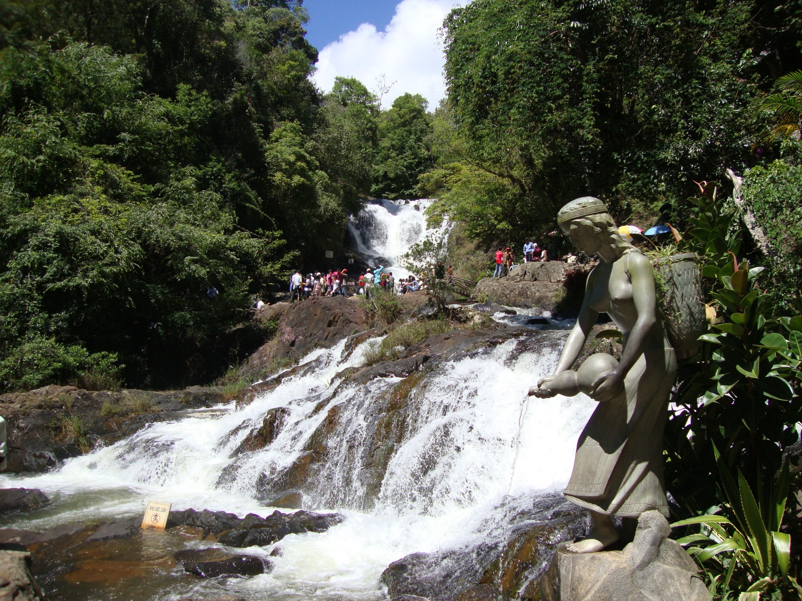

Sáu giờ ba mươi sáng thứ bảy, chiếc xe giường nằm rời bến xe miền Đông trong cái nóng 32 độ của Sài Gòn. Sáu tiếng sau, khi mắt vừa mở khỏi giấc ngủ vặt dọc quốc lộ 20, bạn đã ở một thế giới khác: 17 độ C, thông reo hai bên đường, hơi sương phả vào mặt qua ô cửa xe. Hơn 300 km đường núi, gần 1.500 mét độ cao — đó là khoảng cách giữa hai mùa trong cùng một ngày, và là lý do người Sài Gòn [vẫn cứ mãi tìm về Đà Lạt]().

Không cần tour, không cần trả trước hàng loạt dịch vụ, một chuyến Đà Lạt tự túc 3 ngày 2 đêm hoàn toàn nằm trong tầm tay nếu bạn nắm được ba thứ: thời điểm, phương tiện và ngân sách. Bài viết này tổng hợp từ Wikipedia cùng các nguồn cập nhật năm 2026 để bạn có một cẩm nang đầy đủ trước khi lên đường.

## Khi nào nên đi Đà Lạt — Và nên mang gì

Đà Lạt nằm trên cao nguyên Lâm Viên, ở độ cao khoảng 1.500 mét so với mực nước biển, cách Thành phố Hồ Chí Minh 307 km về phía bắc. Chính độ cao này ban cho thành phố một khí hậu miền núi ôn hòa hiếm thấy: hai mùa rõ rệt, mùa mưa bắt đầu từ cuối tháng 4 và kéo dài đến tháng 10, còn mùa khô chạy từ tháng 11 đến đầu tháng 4 năm sau.

Nếu muốn săn nắng, hãy chọn mùa khô — đặc biệt từ tháng 12 đến tháng 3, thời điểm thành phố đón khoảng 2.236 giờ nắng mỗi năm, tập trung chủ yếu vào các tháng này. Nhiệt độ trung bình quanh năm chỉ khoảng 17–18 độ C, nhưng điều khiến người lạ lẫm nhất là biên độ ngày đêm: chênh lệch trung bình lên tới 10 độ, có tháng mùa khô tới 13–14 độ. Vào những đêm cuối năm, nhiệt độ có thể rơi xuống 10–12 độ, thậm chí dưới 9 độ. Một chiếc áo khoác gió, một đôi giày thoải mái và một chiếc áo ấm mỏng cho buổi tối là đủ cho gần như mọi mùa.

Mùa mưa (tháng 5–10) vẫn đi được, nhưng lượng mưa tập trung nặng nhất vào tháng 7 và khoảng cuối tháng 8 đến đầu tháng 10. Tháng 9 và 10 cũng là thời điểm sương mù dày đặc nhất — Đà Lạt có trung bình 80 đến 85 ngày sương mù mỗi năm — khiến tầm nhìn từ các điểm cao như Langbiang bị hạn chế.

## Từ Sài Gòn lên Đà Lạt bằng gì

Xe khách giường nằm vẫn là lựa chọn phổ biến và tiết kiệm nhất. Hành trình khoảng 6–7 tiếng, giá vé dao động 200.000–500.000 đồng một người tùy hãng và chất lượng xe, với các tuyến quen thuộc như Phương Trang, Thành Bưởi. Nhiều người chọn chuyến đêm — lên xe lúc tối thứ sáu, ngủ một giấc, sáng thứ bảy đã có mặt ở Đà Lạt và tiết kiệm được một đêm khách sạn. Nếu chịu chi hơn chút, xe limousine khứ hồi có giá khoảng 700.000–800.000 đồng với giường rộng và phục vụ tận nơi.

Máy bay nhanh hơn nhưng đắt hơn: sân bay Liên Khương nằm cách trung tâm Đà Lạt 28 km về phía nam, vé một chiều từ Sài Gòn vào ngày thường thường dưới 1.000.000 đồng, có thể tăng gấp đôi vào dịp lễ. Từ sân bay, bạn đi thêm khoảng 40 phút ô tô hoặc xe trung chuyển vào thành phố.

Một tin tốt cho tương lai gần: trục cao tốc Dầu Giây – Liên Khương dài hơn 200 km đang được thi công dở dang, trong đó đoạn Bảo Lộc – Liên Khương khởi công tháng 6/2025 và Tân Phú – Bảo Lộc khởi công cuối năm 2025. Khi hoàn thành dự kiến vào cuối năm 2027, thời gian từ Sài Gòn lên Đà Lạt sẽ rút từ 6 giờ xuống còn khoảng 3 giờ — nhưng hiện tại, hãy cứ tính quỹ thời gian theo đường cũ.

Trong thành phố, thuê xe máy là phương án tối ưu cho dân tự túc: giá 100.000–200.000 đồng một ngày, đủ để chạy từ hồ Xuân Hương ra đèo Prenn. Không muốn tự lái thì taxi, Grab sẵn khắp trung tâm. Đừng quên ga Đà Lạt — công trình kiến trúc Pháp xây từ năm 1932 đến 1938 — nơi còn giữ tuyến đường sắt du lịch 7 km chạy từ ga Đà Lạt đến Trại Mát, một trải nghiệm nhẹ nhàng đáng thử vào buổi sáng.

## Ở đâu: Từ bình dân đến cao cấp

Ngân sách lưu trú là khoản dễ đẩy chi phí chuyến đi lên cao nhất, nhất là vào cuối tuần khi nhiều khách sạn áp phụ phí tăng giá. Nhà nghỉ và khách sạn bình dân có giá khoảng 600.000–1.000.000 đồng cho hai đêm; khách sạn 2–3 sao ở mức 500.000–800.000 đồng mỗi đêm, còn các homestay có view rừng thông thường từ 1.000.000 đồng mỗi đêm trở lên.

Kinh nghiệm chung từ các dân tự túc: đặt phòng càng sớm càng tốt, tránh đặt sát ngày lễ và cuối tuần dài nếu muốn giữ giá gốc. Những khu vực quanh hồ Xuân Hương và trung tâm thuận tiện đi bộ, nhưng giá cao hơn; chấp nhận xa trung tâm một chút, bạn sẽ có giá tốt hơn nhiều với không gian rộng rãi.

## Ăn gì ở Đà Lạt

Ẩm thực Đà Lạt thuộc loại dễ chịu về giá: một phần ăn thông thường từ 30.000 đến 60.000 đồng. Nhờ khí hậu ôn đới, thành phố nổi tiếng với rau xanh và hoa quả sạch — các vườn ngoại ô trồng dâu tây, đào, mận, hồng — cùng những đặc sản có thương hiệu lâu năm như trà atiso, mứt trái cây, rượu vang và cà phê. Một tô mì Quảng hay bánh canh nóng buổi sáng giữa trời se lạnh, một ly cà phê nhìn ra đồi thông, rồi kết thúc ngày bằng chợ Đà Lạt mua ít hồng treo gió và trà atiso làm quà — đó là nhịp sống ẩm thực vừa đủ của một chuyến tự túc.

## Lịch trình 3 ngày 2 đêm gợi ý

Ngày thứ nhất, sau khi nhận phòng, hãy dành buổi chiều cho vòng quanh trung tâm: hồ Xuân Hương rộng 38 ha, được tạo lập từ năm 1919 và nằm giữa lòng thành phố như một điểm tựa cho mọi hoạt động, cùng đồi Cù và quảng trường Lâm Viên — tất cả đều miễn phí. Buổi tối, chợ Đà Lạt là nơi duy nhất bạn vừa ăn vừa mua quà trong cùng một quãng đi bộ.

Ngày thứ hai dành cho vòng ngoài. Khu du lịch Langbiang — "nóc nhà Đà Lạt" — có vé cổng 50.000 đồng người lớn, và xe jeep lên đỉnh Radar khoảng 120.000 đồng mỗi người nếu ghép xe. Trên đường về, đồi chè Cầu Đất với những luống chè xanh ngút tầm mắt là điểm miễn phí được nhắc đến nhiều nhất trong các cẩm nang. Nếu thích nước, bạn có thể đổi hướng sang hồ Tuyền Lâm, đi cáp treo từ đồi Robin sang Thiền viện Trúc Lâm trên núi Phụng Hoàng — cáp treo có giá khoảng 80.000–150.000 đồng một chiều tùy loại vé.

Ngày cuối, ghé ga Đà Lạt chụp ảnh và có thể đi tàu Trại Mát, rồi chọn một trong các điểm còn lại như vườn hoa thành phố (100.000 đồng) hoặc thung lũng Tình Yêu (250.000 đồng) trước khi trả xe và bắt xe về Sài Gòn vào chiều.

## Chi phí 3 ngày 2 đêm hết bao nhiêu

Theo các cẩm nang cập nhật đầu năm 2026, một chuyến Đà Lạt tự túc 3 ngày 2 đêm xuất phát từ Sài Gòn dao động 2.500.000–4.000.000 đồng một người, nếu đi xe khách hoặc limousine, ở khách sạn 3 sao trở xuống và tham quan các điểm có vé phổ biến. Con số này tương đương khi tính theo cặp đôi: các bảng dự trù cho hai người cũng ghi nhận mức 4.300.000–7.100.000 đồng cho cả chuyến.

Phân bổ tham khảo cho một người: di chuyển khứ hồi 400.000–800.000 đồng; lưu trú hai đêm 400.000–900.000 đồng; ăn uống cả chuyến 700.000–1.000.000 đồng; vé tham quan và cà phê 400.000–800.000 đồng. Nếu bạn chọn toàn điểm miễn phí và xe đêm, con số có thể kéo về dưới 2,5 triệu; ngược lại, thêm máng trượt, dù lượn hay phòng view, nó dễ vượt 4 triệu.

## Giá vé các điểm tham quan chính 2026

Để dự trù chính xác hơn, dưới đây là mức giá tham khảo được các trang cẩm nang ghi nhận trong năm 2026 — lưu ý giá có thể thay đổi theo mùa, hãy đối chiếu bảng niêm yết tại quầy trước khi mua:

- Khu du lịch thác Datanla: vé cổng khoảng 50.000–80.000 đồng người lớn, trẻ em 25.000–50.000 đồng; máng trượt Alpine Coaster khứ hồi 200.000–250.000 đồng; mở cửa khoảng 7h–17h mỗi ngày. Nằm ngay đèo Prenn, cách trung tâm 5–6 km.
- Núi Langbiang: vé cổng 50.000 đồng, trẻ em 25.000 đồng; xe jeep khứ hồi lên đỉnh 120.000 đồng một người (ghép xe); dù lượn 600.000–800.000 đồng nếu muốn thử cảm giác mạnh.
- Cáp treo Đà Lạt (đồi Robin – Thiền viện Trúc Lâm): 80.000–150.000 đồng tùy chiều và loại vé.
- Ga Đà Lạt: vé tham quan khoảng 50.000 đồng; vé tàu Đà Lạt – Trại Mát tính riêng.
- Vườn hoa thành phố: 100.000 đồng người lớn, 50.000 đồng trẻ em.
- Thung lũng Tình Yêu: 250.000 đồng người lớn, 125.000 đồng trẻ em.
- Miễn phí: hồ Xuân Hương, quảng trường Lâm Viên, hồ Tuyền Lâm, Thiền viện Trúc Lâm, chùa Linh Phước, đồi chè Cầu Đất.

## Những điều thực tế cần ghi nhớ

Cuối cùng, vài lưu ý rút ra từ chính những con số trên. Thứ nhất, đi xe đêm thứ sáu là cách tiết kiệm nhất cả về tiền vé lẫn một đêm lưu trú. Thứ hai, tránh cuối tuần dài và ngày lễ nếu muốn phòng ở giá gốc — phụ phí cuối tuần là khoản "đội vốn" lớn nhất của dân tự túc. Thứ ba, tháng 7 đến tháng 10 có mưa nhiều, còn tháng 9–10 sương mù dày, nên các hoạt động ngắm cảnh từ trên cao cần linh hoạt đổi lịch. Và cuối cùng, một chi tiết hành chính nhỏ nhưng đáng biết: từ tháng 7/2025, Đà Lạt không còn là một thành phố trực thuộc tỉnh như trước — nhưng với du khách, thành phố sương mù vẫn vẹn nguyên những gì làm nên tên tuổi của nó.

Đà Lạt không phải là điểm đến xa xôi với người Sài Gòn — nó chỉ cách một giấc ngủ trên xe. Nếu muốn khám phá sâu hơn về kiến trúc và văn hóa của thành phố, hãy đọc cẩm nang du lịch Đà Lạt từ A đến Z của blog; còn bản đồ du lịch Việt Nam thì luôn còn nhiều hành trình thú vị khác để bạn lên kế hoạch sau chuyến đi này.
