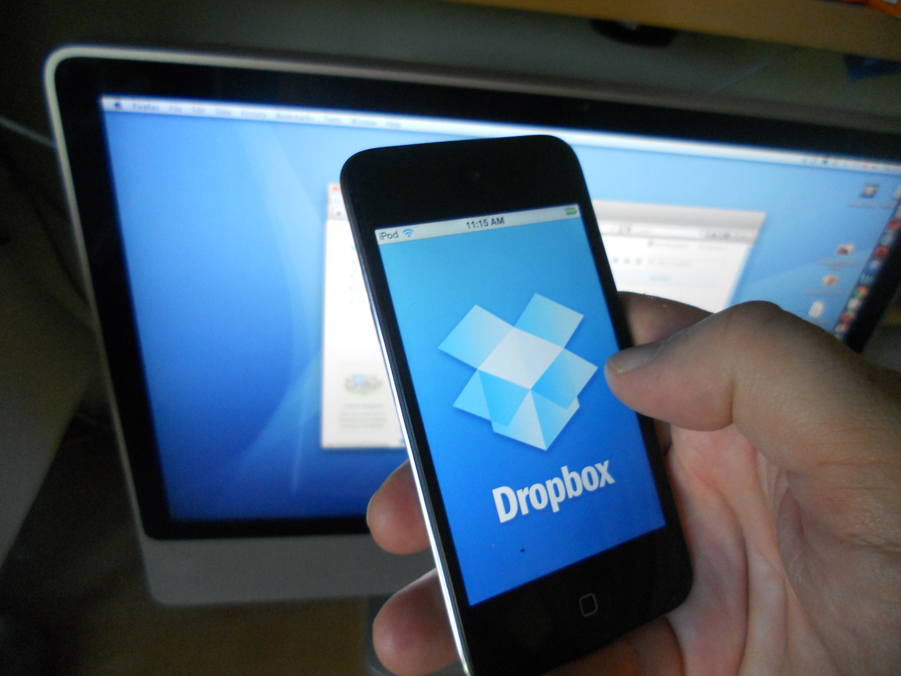

Hãy thử nhớ lại lần cuối bạn mở Dropbox. Với đa số mọi người, câu trả lời trung thực nhất là: không thể nhớ nổi. Tài khoản vẫn còn đó, nhưng bạn gần như đã quên mất sự tồn tại của nó. Và điều kỳ lạ là, với một công ty từng được xem là tương lai của công nghệ lưu trữ, đó lại là một kết thúc đầy ám ảnh.

Bởi Dropbox chưa chết. Công ty vẫn kiếm hơn 2,5 tỷ đô mỗi năm, vẫn có hơn 18 triệu người dùng trả phí. Nhưng về mặt văn hóa, nó vô hình. Và câu chuyện về cách một công ty đã phát minh ra cả một ngành công nghiệp, rồi lặng lẽ bị lãng quên, đáng để kể lại từ đầu.

## Chiếc USB bị quên trên xe bus

Đầu những năm 2000, việc chuyển một tập tin từ máy tính này sang máy tính khác là một cực hình. Bạn copy vào USB và hy vọng không làm mất nó. Hoặc gửi email cho chính mình, chỉ để vấp phải giới hạn dung lượng khó chịu. Đa số mọi người không thèm bận tâm đến giải pháp nào phức tạp hơn thế.

Drew Houston, một chàng trai 24 tuổi tốt nghiệp MIT, đã quên ổ cứng di động của mình quá nhiều lần. Và vào năm 2007, trên một chuyến xe bus từ Boston đến New York, chiếc USB bị bỏ quên một lần nữa — và đó là giọt nước tràn ly. Anh dành nhiều giờ trên xe để viết mã cho một giải pháp. Giải pháp đó sau này trở thành Dropbox.

Houston dành nhiều tháng hoàn thiện bản prototype. Khi cảm thấy sẵn sàng, anh nộp đơn vào Y Combinator — một trong những vườn ươm danh giá nhất Thung lũng Silicon, từng tạo ra Airbnb và Reddit. Nhưng có một vấn đề: Paul Graham, đồng sáng lập Y Combinator, nói rằng ý tưởng thú vị đấy, nhưng anh cần một đồng sáng lập.

Houston không bỏ cuộc. Anh làm một đoạn video ngắn quay màn hình Dropbox đang chạy và đăng lên Hacker News — diễn đàn nơi các nhà sáng lập và nhà đầu tư lui tới hàng ngày. Video leo lên vị trí số một và giữ nguyên trong hai ngày. Nó lọt vào mắt Arash Ferdowsi, một sinh viên MIT khác. Hai người gặp nhau, và cuối cuộc trò chuyện, Arash quyết định bỏ dở tấm bằng dù chỉ còn vài tháng nữa là tốt nghiệp. Ý tưởng đó quá tốt để bỏ lỡ.

## TechCrunch 50 và cú chạm ngoạn mục

Tháng 9 năm 2008, Houston đứng trên sân khấu TechCrunch 50 để trình diễn Dropbox lần đầu tiên trước công chúng. Suýt nữa thì đó là một thảm họa — Wi-Fi đứt giữa buổi demo. Nhưng Houston đã chuẩn bị sẵn một video dự phòng. Khi ông bước xuống sân khấu, danh sách chờ đã có gần 200.000 người.

Ý tưởng thì gần như ngớ ngẩn đến mức đơn giản: một thư mục trên desktop tự động đồng bộ mọi tập tin đến mọi thiết bị bạn sở hữu. Bạn lưu thứ gì đó trên điện thoại, và nó xuất hiện ở mọi nơi khác. Ở thời điểm đó, điều đó giống như một phép màu nhỏ.

Chương trình giới thiệu bạn bè của Dropbox cũng đơn giản không kém: mời một người bạn, cả hai cùng nhận 500MB dung lượng miễn phí. Chỉ trong 15 tháng, Dropbox đi từ 100.000 lên 4 triệu người dùng — tốc độ tăng trưởng 3.900%. Các con số lớn đến nỗi đội ngũ hết tường để dán giấy in milestone và phải chuyển lên trần nhà.

## Cuộc gặp với Steve Jobs

Cuối năm 2009, trước tất cả những cột mốc đó, có một cuộc gặp. Ngôi sao nhạc rock của giới công nghệ thập niên 2000 muốn nói chuyện. Đó là Steve Jobs.

Drew và Arash lái một chiếc Zipcar đến trụ sở Apple ở Cupertino. Houston sau này thừa nhận cảm giác thật khó tả: "Ý tôi là, Steve Jobs chết tiệt. Làm sao bạn có thể chuẩn bị cho điều đó?"

Jobs đề nghị mua Dropbox với giá hơn 800 triệu đô. Drew nói không. Jobs mỉm cười và nói một câu đầy tiên tri: theo ông, Dropbox chỉ là một tính năng (feature), không phải một sản phẩm thực thụ — và Apple đang lên kế hoạch đánh thẳng vào thị trường này.

Houston bước ra khỏi phòng với sự tự tin. Một mối đe dọa có thể nhìn thấy thì cũng có thể đánh bại. Nhưng điều Drew không thấy được là quy mô của những gì sắp đến.

Khi bạn xây dựng một sản phẩm thực sự hữu ích cho người dùng, nhưng lại không có sự khác biệt nào về thị trường, các công ty lớn hơn cuối cùng sẽ nghiền nát bạn. Và quá trình đó đã bắt đầu.

## Màn hình nấm ở phía xa

Apple ra mắt iCloud vào tháng 10 năm 2011, tích hợp thẳng vào mọi iPhone, iPad và Mac. Google Drive theo sau vào tháng 4 năm 2012. Microsoft đổi tên SkyDrive thành OneDrive vào năm 2014, gộp nó với Windows và Office 365.

Houston sau này mô tả cảm giác đó giống như nhìn một đám mây hình nấm ở phía xa — bạn thấy nó nhưng chưa thể cảm nhận được. Các sản phẩm cạnh tranh ra mắt, nhưng nhìn vào số liệu của Dropbox, bạn sẽ không bao giờ biết được điều đó đã xảy ra.

Nhưng hãy nhìn vào những con số. Dropbox tặng 2GB miễn phí. Google Drive tặng 15GB — gấp hơn bảy lần. Gói trả phí của Google từ 1,67 đô/tháng. Trong khi đó, gói rẻ nhất của Dropbox là 9,99 đô/tháng. Còn với người đã trả tiền cho Microsoft 365, họ được tặng nguyên một terabyte. iCloud thậm chí không cần cạnh tranh về giá — nó đã ở đó sẵn rồi, chạy trên hàng trăm triệu thiết bị Apple.

Với Google, Microsoft, Apple, lưu trữ chưa bao giờ là sản phẩm. Nó là cách kéo người dùng vào hệ sinh thái của họ. Họ có thể bán lưu trữ rẻ vì họ có khả năng đó. Dropbox thì không có hệ sinh thái nào để móc nối người dùng. Chính trong báo cáo tài chính, công ty đã thừa nhận một cách đáng ngạc nhiên: "Một số đối thủ cạnh tranh có lợi thế cố hữu trong việc phát triển các sản phẩm tích hợp chặt chẽ hơn với nền tảng phần mềm và phần cứng của họ." Đó là cách nói lịch sự rằng cuộc chơi đã bị dàn xếp từ đầu.

## Vụ rò rỉ và sự im lặng chết người

Năm 2012, hacker xâm nhập Dropbox qua một mật khẩu nhân viên bị đánh cắp và lặng lẽ lấy đi thông tin đăng nhập của 68 triệu tài khoản. Đáng lẽ chỉ riêng điều đó đã đủ gây chấn động. Nhưng phản ứng của Dropbox còn tệ hơn: họ cố gắng phủi sạch mọi dấu vết.

Dropbox âm thầm reset mật khẩu mà không bao giờ giải thích tại sao hay có bao nhiêu người bị ảnh hưởng. Bốn năm sau, năm 2016, dữ liệu bị đánh cắp xuất hiện trên web đen để bán. Bốn năm im lặng cho một vụ rò rỉ ở quy mô đó — người dùng không thể tha thứ.

Edward Snowden, cựu nhân viên NSA, đích danh gọi Dropbox là "thù địch với quyền riêng tư". Và như thể để xác nhận mọi nghi ngờ, Condoleezza Rice — cựu Ngoại trưởng Mỹ từng công khai bảo vệ chương trình giám sát hàng loạt của NSA — gia nhập hội đồng quản trị Dropbox.

## Cơn khủng hoảng danh tính

Trong khi đó, Dropbox phóng đi đủ thứ sản phẩm mới: Paper (trình soạn thảo tài liệu), Mailbox (ứng dụng email được mua lại với giá 100 triệu đô), Carousel (công cụ quản lý ảnh), rồi password manager, document scanner, Spaces. Và một khuôn mẫu dễ đoán xuất hiện: xây dựng, tung ra, không ai dùng, rồi đóng cửa. Mailbox và Carousel biến mất đầu năm 2016. Password Manager kéo dài được 5 năm trước khi bị khai tử vào tháng 10 năm 2025.

Các sản phẩm thất bại chỉ ra một cuộc khủng hoảng danh tính thực sự. Dropbox không bao giờ quyết định được mình muốn trở thành công ty gì.

Năm 2019, tài khoản miễn phí bị giới hạn còn ba thiết bị — trong khi mọi đối thủ vẫn cho phép không giới hạn. Cùng năm đó, giá thuê bao tăng 20%. Từ đỉnh điểm 3.100 nhân viên năm 2022, công ty đã cắt giảm xuống còn khoảng 2.100 — mất đi gần một phần ba lực lượng lao động.

Tháng 12 năm 2024, Dropbox vay 2 tỷ đô bằng nợ có bảo đảm và ngay lập tức công bố chương trình mua lại cổ phiếu trị giá 1,2 tỷ đô. Đi vay để mua lại cổ phiếu thay vì đầu tư vào tăng trưởng — trong giới tài chính, người ta gọi đó là "chiến lược thu hoạch". Về cơ bản, bạn ngừng cố gắng. Bạn rút ra giá trị còn lại chừng nào nó còn kéo dài.

## Bài học từ sự lãng quên

Nhìn lại, quyết định đắt giá nhất của Dropbox không phải là từ chối Steve Jobs. Đó là tất cả những gì diễn ra sau đó. Câu chuyện về Dropbox thực ra là một ý tưởng duy nhất: nếu toàn bộ sản phẩm của bạn có thể được sao chép với giá rẻ hơn và bạn không có lợi thế khác biệt nào, bạn có một vấn đề cấu trúc mà không chiến thuật tiếp thị nào giải quyết được.

Stripe, Snowflake, Databricks — tất cả đều đối mặt với mối đe dọa tương tự và giữ vững vị thế nhờ vào chiều sâu kỹ thuật thực sự khó sao chép. Dropbox thì thanh lịch, nhưng chưa bao giờ khó sao chép đến thế.

Ở TechCrunch 2008, một thành viên ban giám khảo đã hỏi câu hỏi mà ngày nay nghe như một lời nguyền: "Câu hỏi lớn nhất là: tại sao đây không chỉ là một tính năng của hệ thống của người khác — Google hay Microsoft chẳng hạn?"

Steve Jobs đã có lý vào năm 2009. Các tính năng cuối cùng luôn bị hấp thụ bởi các nền tảng. Và Dropbox là một tính năng, không phải một sản phẩm. Câu hỏi chỉ là: sẽ mất bao lâu để nó bị thay thế? Câu trả lời hóa ra là khoảng mười lăm năm.

## Bạn vẫn còn dùng Dropbox chứ?

Dropbox không phải là một câu chuyện sụp đổ. Đèn vẫn sáng. Drew Houston đã xây dựng một thứ gì đó thực sự mới mẻ. Anh biến một chiếc USB bị quên thành công ty trị giá 10 tỷ đô, nhìn thẳng vào mặt Steve Jobs và nói không. Anh sống sót qua một thập kỷ áp lực từ những công ty công nghệ lớn nhất hành tinh. Đó không phải là chuyện nhỏ.

Nhưng đôi khi, sự lãng quên còn ám ảnh hơn cả sự sụp đổ. Nơi từng là một cái tên được nhắc đến như một phép màu, giờ chỉ còn là một biểu tượng trên ổ ứng dụng mà không ai còn nhớ lý do tại sao nó ở đó.
