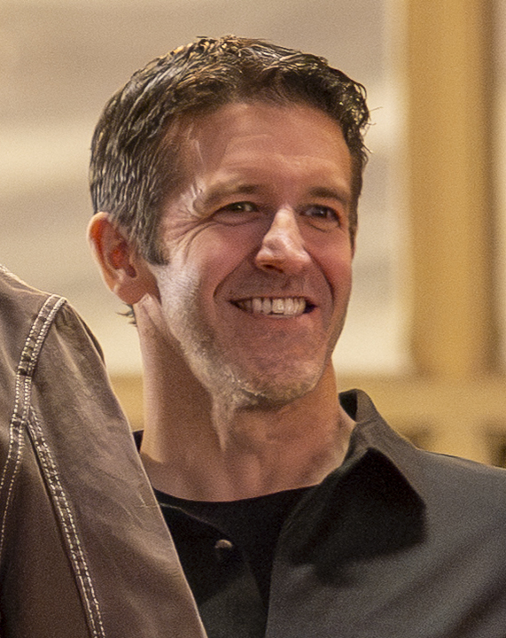

Ngày 24 tháng 8 năm 2011. Một thông cáo báo chí của Apple công bố cái tên lạ hoắc: Tim Cook, CEO mới. So với Steve Jobs, chẳng ai biết ông này là ai. Ngày hôm sau khi nhậm chức, Cook viết một email nội bộ: "Apple sẽ không thay đổi. Tôi tin rằng những năm tháng tốt đẹp nhất vẫn còn ở phía trước."

Về mặt tài chính, Tim đã đúng. Khi ông bắt đầu làm CEO, Apple được định giá 350 tỷ đô. Con số đó đã phình lên thành 4 nghìn tỷ. Công ty chưa bao giờ ở vị thế tốt hơn trong một thời gian dài — dù đã trải qua các vụ kiện chống độc quyền trên khắp thế giới và những cáo buộc bóp nghẹt cạnh tranh.

Nhưng mọi thứ sắp thay đổi. Ngày 21 tháng 4 năm 2026, Apple chính thức xác nhận: Tim Cook sẽ rời ghế CEO. Ngày cuối cùng của ông là 31 tháng 8.

## Người kế nhiệm vô danh

Ngày 1 tháng 9, một kỹ sư cơ khí đến từ Pennsylvania — người mà bạn có thể đã thấy thoáng qua trong các buổi keynote của Apple — trở thành giám đốc điều hành quyền lực nhất hành tinh. Tên ông là John Ternus. Và dù bạn có biết hay không, ông đã định hình gần như mọi thiết bị Apple bạn từng sở hữu.

Với hầu hết những người đam mê công nghệ, Ternus là gương mặt quen thuộc tại các sự kiện ra mắt sản phẩm của Apple. Nhưng vai trò thực sự của ông trong công ty lớn hơn nhiều so với những lần xuất hiện đó. Dấu vân tay của ông ở khắp mọi thiết bị.

Ternus tốt nghiệp Đại học Pennsylvania với bằng kỹ sư cơ khí. Trước cả khi đến Apple, dự án đại học cuối cùng của ông là chế tạo một cánh tay robot cho bệnh nhân liệt tứ chi, điều khiển hoàn toàn bằng chuyển động đầu. Ông gia nhập Apple năm 2001, bắt đầu sự nghiệp với việc phát triển màn hình — những chiếc Cinema Display mà theo những người từng sở hữu thì đến nay vẫn hoạt động hoàn hảo. Ở thời điểm năm 2002, khi hầu hết mọi người còn dùng màn hình CRT, Cinema Display với tấm nền LCD phẳng là một kiệt tác thiết kế.

Sau đó, Ternus chuyển sang iPad, làm việc trên đó từ nguyên mẫu đầu tiên. Ông thúc đẩy nội bộ để iPad OS trở thành một hệ điều hành riêng — thời điểm đó iPad về cơ bản chỉ chạy phần mềm iPhone, và Ternus tin rằng điều đó đang kìm hãm phần cứng. Như chúng ta đã biết, ông đã thắng cuộc tranh luận đó. Ông tiếp tục giám sát AirPods và đóng vai trò then chốt trong quá trình chuyển đổi sang Apple Silicon — dòng chip M-series. Gần đây nhất, ông có công lớn trong MacBook Neo — chiếc laptop 599 đô mà chính ông công bố tại New York, nhận được sự hoan nghênh gần như tuyệt đối.

## Người đã đúng về Vision Pro và Apple Car

Điều thú vị là Ternus không phải là fan của Vision Pro. Theo các nguồn tin nội bộ, sự hoài nghi của ông xuất phát từ kinh nghiệm cá nhân. Đầu những năm 1990, ông từng làm việc tại Virtual Research Systems — một công ty thử nghiệm tạo headset thực tế ảo, và kết quả là thảm họa. Ông cũng lo ngại về dự án xe tự lái của Apple, sợ rằng nó sẽ làm công ty xao nhãng, tiêu hao lợi nhuận và kéo các kỹ sư ra khỏi những sản phẩm cốt lõi. Trong cả hai trường hợp, ông đều đúng: dự án xe bị hủy, Vision Pro — dù là một sản phẩm tốt — đã thất bại về mặt thương mại.

Tất nhiên, Ternus cũng có sai lầm. Touch Bar và bàn phím cánh bướm (butterfly keyboard) thảm họa — dẫn đến một vụ kiện tập thể 50 triệu đô — xảy ra dưới thời ông. Nhưng nhìn chung, Ternus là người có khả năng đọc đúng nhu cầu thực sự của người dùng thường xuyên hơn là sai.

## Ba kỷ nguyên: Steve Jobs, Tim Cook, John Ternus

Tim Cook có thể tóm gọn bằng một cụm từ: mở rộng. Thiên tài của Cook không phải nằm ở sản phẩm — mà ở hệ thống công ty, chuỗi cung ứng, các thỏa thuận sản xuất, các mối quan hệ ngoại giao với chính phủ. Ông lấy một công ty được xây dựng trên tầm nhìn sản phẩm của Steve Jobs và biến nó thành một cỗ máy toàn cầu hiệu quả đến mức nó trở thành một trong những công ty có lợi nhuận cao nhất Trái Đất. Cổ phiếu Apple tăng gần 2.000% trong nhiệm kỳ của ông.

Jobs là thời đại của sự đổi mới. Cook là thời đại của sự mở rộng. Và Ternus — theo Mark Gurman, một trong những nguồn tin đáng tin cậy nhất về Apple — có thể là thời đại của phần cứng.

Những quân cờ đã được di chuyển trong suốt hai năm. Một CFO mới, một cố vấn pháp lý mới, Johny Srouji được thăng chức lên giám đốc phần cứng. Công ty đang tái cấu trúc cho kỷ nguyên tiếp theo. Có tin đồn về một chiếc iPhone gập — thiết bị mà Ternus gần như chắc chắn sẽ công bố trong buổi keynote đầu tiên với tư cách CEO. Một iPad gập gần 20 inch cũng đang trong quá trình phát triển. Ternus cũng đang thử nghiệm các thiết bị đeo có camera, kính thông minh và thậm chí cả một mặt dây chuyền có thị giác máy tính.

## Kỷ nguyên AI — nhưng theo cách của Apple

Con voi trong phòng — ít nhất là đối với các cổ đông — là AI. Apple cần tìm vị trí của mình trong thế giới mới này. Và việc nâng cấp Siri đầy thất vọng, về cơ bản là bỏ cuộc và dùng công nghệ của Google, không phải là cách đi.

Nhưng Apple có thể đang đi theo một hướng hoàn toàn khác. Trong khi các công ty khác đổ hàng trăm tỷ đô xây trung tâm dữ liệu, Apple dường như đặt cược vào AI cục bộ — chạy ngay trên thiết bị. Dòng Mac và MacBook Pro của họ cung cấp lượng bộ nhớ thống nhất khổng lồ, có khi lên đến hơn 100GB. Điều đó có nghĩa là các mô hình ngôn ngữ lớn có thể chạy ngay trên máy của bạn — mà không cần internet. Điều này khiến Mac trở thành lựa chọn hàng đầu cho những người đam mê AI cục bộ.

Tầm nhìn của Ternus: AI nhỏ hơn, cục bộ, và tích hợp hoàn toàn — không cần trung tâm dữ liệu khổng lồ. Nếu việc triển khai được thực hiện đúng, người dùng thậm chí không nên nhận thấy rằng AI đã được sử dụng. Đối với Apple, chỉ có một người trong đội ngũ điều hành có thành tích thực sự trong việc tích hợp phần cứng và phần mềm — và đó là Ternus.

## Một kiểu CEO khác

Ternus đã tái tổ chức bộ phận kỹ thuật phần cứng chỉ vài tuần trước, cụ thể là tích hợp AI vào quy trình phát triển sản phẩm. Mac Mini đang có nhu cầu lớn. MacBook Neo 600 đô là đề xuất giá trị tốt nhất mà Apple từng đưa ra. Dưới thời Tim Cook, Apple tạo ra những sản phẩm tuyệt vời và đảm bảo chúng đắt. Dưới thời Ternus, những dấu hiệu ban đầu cho thấy một triết lý mới: cao cấp cho chuyên gia, nhưng cũng có những sản phẩm thực sự tốt ở mức giá mà mọi người có thể chi trả.

Tim Cook đã làm được điều không ai nghĩ là có thể — ông tiếp quản từ Steve Jobs và xây dựng một thứ lớn hơn. Nhưng không phải không có chỉ trích. Ông quá thận trọng, quá dễ đoán, và tập trung vào việc rút tiền từ người dùng thay vì đổi mới đột phá.

Ternus không phải Steve Jobs. Và chắc chắn không phải Tim Cook. Ông có lẽ sẽ không bước lên sân khấu và cách mạng hóa cả một ngành công nghiệp chỉ bằng một sản phẩm. Ông sâu sắc, không thích đối đầu, và theo hầu hết các tài khoản, là một người thực sự tốt. Ở Thung lũng Silicon, đó gần như là một dấu hiệu đáng ngờ.

Nhưng ông chính xác là những gì Apple có lẽ cần lúc này: không phải một người có tầm nhìn xa, mà là một kỹ sư thực thụ — người hiểu tại sao mọi thứ hoạt động và tại sao chúng không. Người đã đúng về Apple Car, đúng về iPad, sai về bàn phím cánh bướm, và đã dành 25 năm để hiểu sâu về từng con ốc vít trong mỗi sản phẩm Apple.

Steve Jobs là người nghĩ. Tim Cook là người vận hành. John Ternus — nếu giữ được phong độ — có thể là người xây dựng. Nhưng chúng ta sắp biết câu trả lời.
