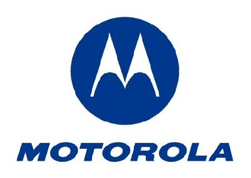

Hầu hết mọi người nhớ về Motorola như một thương hiệu di động hoài niệm — thương hiệu của thế hệ millennial và những thùng rác lịch sử. Nhưng điều ít ai biết là công ty chưa hề biến mất. Thực tế, nó đang phát triển thịnh vượng với mức định giá 60 tỷ đô. Ở hình hài mới, Motorola đã trở thành lựa chọn yêu thích của lính cứu hỏa, nhân viên cấp cứu và cảnh sát. Thiết bị của họ — từ bộ đàm cho nhiệm vụ sống còn đến camera gắn trên xe cảnh sát — đang thống trị một ngành công nghiệp mà ít người tiêu dùng bình thường để ý đến.

Nhưng câu chuyện của Motorola còn đáng kinh ngạc hơn thế. Họ đã góp mặt trong những khoảnh khắc quan trọng nhất của lịch sử nhân loại. Cuộc đổ bộ lên Mặt Trăng của Apollo — câu nói "Một bước nhỏ của con người" được phát qua một máy thu của Motorola. Chiếc điện thoại di động đầu tiên trên thế giới — do chính họ phát minh. Thế rồi, trong thời hiện đại, công ty gần như biến mất khỏi mắt công chúng, nhưng vẫn âm thầm đạt được những thành tựu đáng nể. Và bộ phận điện thoại thông minh của họ cũng đang quay trở lại. Nghe có vẻ khó tin, nhưng đó là sự thật.

## Chiếc gạch phóng xạ làm thay đổi thế giới

Cho đến những năm 1970, nói đến liên lạc qua điện thoại, bạn chỉ có điện thoại bàn, điện thoại công cộng và điện thoại trên ô tô. Rõ ràng không có thứ nào thực sự di động được. Hai công ty muốn thay đổi điều này: Motorola và Bell Labs.

Bell Labs đã ấp ủ ý tưởng về điện thoại di động trong nhiều thập kỷ, nhưng họ vướng phải bức tường gạch: điện thoại trên ô tô rất cồng kềnh, phụ thuộc vào pin xe và cực kỳ không đáng tin cậy. Tiến sĩ Martin Cooper của Motorola tin rằng người tiêu dùng muốn thứ gì đó khác, ngay cả khi đối thủ của ông không đồng ý.

Sau khi tạo ra sản phẩm thử nghiệm, Cooper thực hiện một nước đi táo bạo: ông gọi cuộc gọi di động đầu tiên trên thế giới — đến thẳng Bell Labs. Ông kể lại với NPR: "Tôi nói: Tôi đang gọi cho anh từ một chiếc điện thoại di động, một chiếc điện thoại di động thật sự. Anh có thể nhận thấy tôi không hề ngại chà mũi họ vào thành tựu của chúng tôi."

Trông nó như một cục gạch phóng xạ, nhưng với năm 1973, đó là một kỳ quan. Ông tổ của những chiếc smartphone ngày nay.

## Những đỉnh cao và vực sâu

Motorola còn có nhiều hơn thế. Họ tạo ra vi xử lý Motorola 68000 — thứ mà nhiều người coi là bộ vi xử lý hiện đại đầu tiên. Nó mạnh hơn đối thủ nhiều lần, có khả năng đa nhiệm, bộ nhớ ảo và chạy nhiều hệ điều hành cùng lúc trước Intel rất nhiều năm. Nó từng là trái tim của chiếc Apple Macintosh đầu tiên, của Sega Genesis, Atari Jaguar và Sega Saturn.

Năm 1983, Motorola giới thiệu DynaTAC 8000X — chiếc điện thoại di động thương mại đầu tiên. Nó nặng 2,5 pound, pin 30 phút, giá tương đương 12.000 đô ngày nay. Dân chúng vẫn muốn một cái. Motorola bán được 300.000 chiếc.

Vào giữa những năm 2000, Motorola phát hành RAZR V3. Thiết kế của nó mỏng hơn, sang trọng hơn, có vỏ kim loại cao cấp và bàn phím tương lai. Ở thời điểm đó, ai có RAZR là tự động cool. Doanh số toàn cầu vượt 130 triệu — một trong những chiếc điện thoại phổ biến nhất mọi thời đại.

Nhưng thành công đó hóa ra chỉ ngắn ngủi.

## Khi cả thế giới chuyển sang iPhone

Năm 2007, Steve Jobs đứng trên sân khấu và trình làng iPhone. Thế giới thay đổi ngay lập tức. Hầu hết các ông lớn đều bắt đầu hoảng loạn. Ngay cả Nokia — công ty có lợi thế đáng kể — cũng đã tạo ra các bản PowerPoint phác họa iPhone có thể thay đổi mọi thứ như thế nào.

Motorola còn tệ hơn. RAZR đã lỗi thời. Các mẫu mới không kéo được số. Bộ phận điện thoại của họ đang chảy máu — lỗ 1,2 tỷ đô riêng trong quý 4 năm 2007. Cả công ty chỉ kiếm được 100 triệu đô trong cùng quý. Từ năm 2008 đến 2009, chỉ một năm, Motorola mất 40% doanh số bán hàng.

Họ không còn lựa chọn nào khác ngoài việc chia công ty làm đôi: Motorola Solutions và Motorola Mobility. Năm 2011, các mảnh ghép của Motorola lần lượt được bán cho kẻ trả giá cao nhất. Mảng mạng lưới bán cho Nokia Siemens. Motorola Mobility bán cho Google năm 2012 — chủ yếu để lấy bằng sáng chế. Hai năm sau, nó lại được bán cho Lenovo của Trung Quốc.

Có vẻ như Motorola đã hết đường. Sau một cuộc suy thoái dài, họ trở thành một kẻ tiên phong lạc lối. Một đóng góp lớn đã định hình cách thiết bị của chúng ta tiến hóa, nhưng không đủ sức mạnh nội tại để tồn tại.

## Lối thoát bất ngờ

Giữa những tổn thất lớn năm 2008, Motorola đã bí mật chơi một ván bài dài. CEO Greg Brown được bổ nhiệm và nhìn thấy một điều mà ít người khác thấy được. Tương lai của Motorola không nằm ở điện thoại di động — mà ở an toàn và an ninh công cộng.

"Cộng thêm với công lao của Brown, ít hơn đã thành nhiều hơn". Công ty đang trải qua một sự tái sinh — với tên gọi Motorola Solutions. Bộ đàm của họ được lính cứu hỏa sử dụng rộng rãi từ EU đến Mỹ đến Anh. Họ phát triển giải pháp đám mây cho cứu hỏa và dịch vụ khẩn cấp, cắt giảm thời gian phản ứng. Hệ thống camera M500 trên xe cảnh sát được tích hợp AI, quét tìm vũ khí và cảnh báo tổng đài 911 phát hiện mối đe dọa.

Theo các nhà vận hành an ninh, Motorola giờ đây là một trong những nhà cung cấp công nghệ hứa hẹn nhất của thập kỷ. Phần kinh doanh tăng trưởng nhanh nhất của họ là thiết bị an ninh cho bệnh viện, không gian sự kiện và trường học — dùng AI phát hiện hành vi đáng ngờ. Doanh thu đã vượt 10 tỷ đô, gấp 10 lần đối thủ cạnh tranh gần nhất là Axon.

## Sự sống lại của một huyền thoại di động

Điều bất ngờ: bộ phận điện thoại di động của Motorola cũng đang sống lại từ cõi chết. Theo chiến lược gia trưởng của Motorola Mobility, cuộc phẫu thuật cứu chữa nửa điện thoại đang gặp khó khăn của họ diễn ra qua ba giai đoạn.

Giai đoạn một — sau khi được Lenovo mua lại năm 2014 — là cầm máu lỗ. Họ thoát khỏi các phân khúc cao cấp và nhiều thị trường không có lợi nhuận. Giai đoạn hai, khoảng 2018-2019, là ổn định và tăng trưởng. Cuộc gọi 5G đầu tiên trên thế giới được thực hiện trên thiết bị Motorola. Họ tái nhập thị trường Nhật Bản và mở các thị trường mới ở Trung Đông.

Giai đoạn ba là tăng tốc. Với mục tiêu tăng gấp đôi quy mô kinh doanh trong 3-4 năm, họ đã đạt 27% tăng trưởng hàng năm và 43% tăng trưởng doanh thu. Mẫu RAZR gập mới là một đối thủ đáng gờm của Samsung Galaxy Z Flip 7. Họ cũng đang giành lại thị phần ở Ấn Độ, Ả Rập Saudi và UAE.

## Một câu chuyện còn dang dở

Thật khó để tưởng tượng tất cả điều này có thể xảy ra nếu Motorola không bị cắt ra làm đôi vào đỉnh điểm khủng hoảng. Ngày nay, cái tên Motorola có khả năng sống lâu hơn bất kỳ ai từng nghĩ tới.

Nhưng cũng có một mặt trái. Motorola Equipment đã trở thành một công cụ yêu thích của cảnh sát, lính cứu hỏa và nhân viên cứu hộ. Doanh thu của họ đến từ việc giữ an toàn cho con người. Nhưng việc thiết bị giám sát và phản ứng khẩn cấp lại là một ngành công nghiệp bùng nổ — điều đó nói lên nhiều điều về xã hội hơn bất kỳ chu kỳ kinh doanh nào.

Motorola đã đi một vòng tròn đầy đủ. Từ những chiếc radio trên xe cảnh sát những năm 1920, đến cuộc gọi di động đầu tiên, đến RAZR huyền thoại, đến sụp đổ, và cuối cùng là sự trỗi dậy ở một hình hài mà không ai ngờ tới. Họ không còn là một cái tên trong túi áo của bạn nữa — nhưng họ đang ở trong tay của những người cứu sống bạn.
