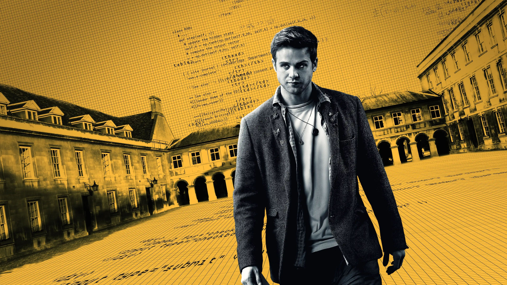
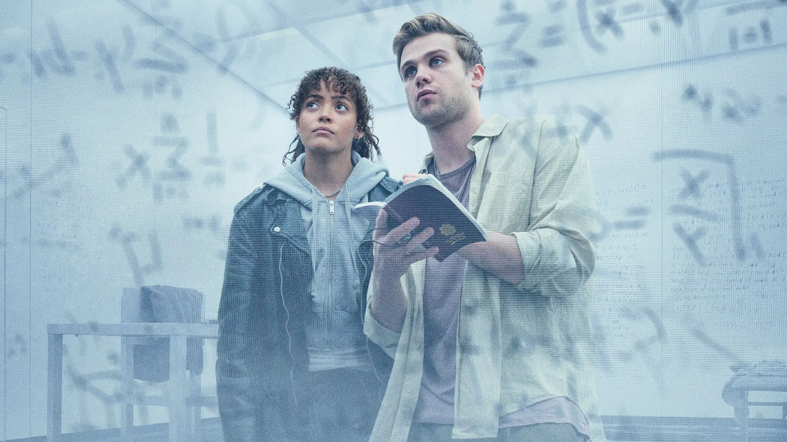

Một người phụ nữ để con gái lại một mình trong tiệm kem. Vừa bước ra khỏi cửa, một vụ nổ khủng bố bùng phát, san phẳng khu vực xung quanh. Người mẹ gượng dậy, vượt qua đám đông gào khóc, thấy con gái mình phía bên kia đống đổ nát. Ngay khi hai mẹ con sắp gặp nhau, mặt đất sụt xuống. Dưới con phố phồn hoa kia lại ẩn giấu một cung điện cổ xưa hàng nghìn năm. Cây kem trên tay cô bé trở thành nhân chứng đầu tiên của một di tích lịch sử vô giá — và cũng là mảnh ghép mở đầu cho chuỗi sự kiện đưa người xem vào thế giới những con số, âm mưu và mật mã đen tối.

*Prime Target* là series truyền hình thuộc thể loại chính kịch — gián điệp, xoay quanh Edward, một nghiên cứu sinh tài năng của Đại học Cambridge. Với vẻ ngoài khiêm tốn và ánh mắt chỉ dành cho những con số, Edward tin rằng mọi thứ trong vũ trụ đều tuân theo quy luật của số nguyên tố. Đàn chim bay trên bầu trời, số cánh hoa trên một bông hồng, thậm chí cả chuyến xe buýt số 204 anh đi mỗi ngày — tất cả đều mang một ý nghĩa toán học sâu xa. Niềm tin ấy khiến giảng viên Robert đau đầu, bởi thay vì hoàn thành nhiệm vụ học viện giao, Edward suốt ngày đắm chìm trong thế giới số học của riêng mình.

## Số nguyên tố và cung điện cổ đại

Mọi chuyện bắt đầu thay đổi khi Edward gặp Andre, vợ của thầy Robert. Bà là giáo sư nghiên cứu lịch sử cổ đại, vừa nhận được lời mời khảo sát một cung điện vừa lộ diện sau vụ nổ khí ga ở Trung Đông. Trong những bức ảnh chụp hiện trường, Edward thoáng thấy hoa văn trên trần vòm — một thoáng đã đủ để anh nhận ra những quy luật số học ẩn giấu bên trong. Anh bắt đầu tính toán ngay trên khăn trải bàn nhà thầy, viết đầy những công thức khiến Robert phải kinh ngạc. Nhưng niềm hứng khởi nhanh chóng bị dập tắt: Robert nghiêm mặt từ chối trình đề tài này lên hội đồng học thuật, thậm chí còn đốt chiếc khăn trải bàn đầy ghi chép. Một ngày sau, ông chết trong nhà để xe với kết luận là tự sát.

Edward tin rằng thầy mình đã bị sát hại. Hành trình đi tìm sự thật của anh dần hé lộ một thế giới ngầm đáng sợ.

Có một tổ chức theo dõi mọi nhà toán học xuất chúng, sẵn sàng loại bỏ bất kỳ ai đến gần bí mật của số nguyên tố. Lý do: số nguyên tố là nền tảng của mọi hệ thống bảo mật kỹ thuật số. Ai tìm ra quy luật của chúng sẽ có thể phá vỡ toàn bộ mã hóa trên thế giới — từ tài khoản ngân hàng, hệ thống quốc phòng, cho đến các báo cáo mật của cả quốc gia. Mức độ nguy hiểm của thứ vũ khí tri thức này còn hơn cả bom hạt nhân.

## Cuộc rượt đuổi xuyên châu Âu

Bộ phim đưa người xem từ Cambridge đến Paris, từ những thư viện đại học cổ kính đến đường hầm xuyên biển, từ những quán bar sinh viên đến cung điện cổ đại ở Trung Đông. Edward cùng với Terra — một nữ đặc vụ đang bị chính tổ chức của mình truy sát — phối hợp để tìm ra mảnh ghép còn thiếu của công thức số nguyên tố. Terra không chỉ là một điệp viên giàu kinh nghiệm mà còn là hacker tài ba, sẵn sàng xâm nhập hệ thống an ninh, cắt camera, đánh lạc hướng kẻ thù để bảo vệ Edward.

Điều khiến *Prime Target* khác biệt là cách nó đặt câu hỏi về trách nhiệm của tri thức. Khám phá khoa học có giá trị tự thân hay nó phải được đánh giá qua hậu quả mà nó gây ra? Edward — với sự ngây thơ của một thiên tài — tin rằng việc tìm ra quy luật số nguyên tố là một khám phá thuần túy mang tính học thuật. Nhưng Terra chỉ ra một sự thật phũ phàng: nghiên cứu của Safia, người đi trước, cũng chỉ là lý thuyết, nhưng kết cục của cô ra sao? Cái chết của Robert, cái chết của Safia, của giáo sư Osborner — tất cả đều là những mảnh ghép trên con đường dẫn Edward đến một sự thật không thể chối cãi: tri thức, trong tay kẻ xấu, trở thành vũ khí hủy diệt.

## Mùa kết và suy ngẫm

Mùa một kết thúc với hình ảnh Edward đứng trên một gò đất nhỏ, nhìn từ xa Terra bị cảnh sát áp giải đi. Anh đã trốn thoát, nhưng không còn là chàng nghiên cứu sinh ngây thơ ngày nào. Trong tay là công thức số nguyên tố hoàn chỉnh — thứ vũ khí có thể phá hủy toàn bộ thế giới số hóa, phơi bày mọi tội lỗi và biến mọi hệ thống bảo mật trở nên vô dụng. Và Edward quyết định sẽ dùng nó để trả thù.

Điều đáng tiếc là *Prime Target* lẽ ra có thể khai thác sâu hơn khía cạnh khoa học viễn tưởng đầy tiềm năng: số nguyên tố, bản chất của vũ trụ, và một thế giới nơi toán học trở thành vũ khí tối thượng. Thay vào đó, series chọn đi theo hướng gián điệp, đấu trí, âm mưu — như một tác phẩm trinh thám hơn là khoa học viễn tưởng. Dù vậy, với một ý tưởng trung tâm đầy mê hoặc và dàn nhân vật được xây dựng tinh tế, *Prime Target* vẫn là một bộ phim đáng xem cho những ai yêu thích thể loại phim gián điệp pha chất toán học hiếm thấy trên màn ảnh.
