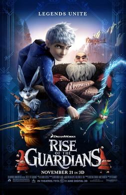

Jack Frost chưa bao giờ nghĩ mình là một anh hùng. Cậu thức dậy từ một mặt hồ đóng băng, không nhớ mình là ai, và nhận ra không một ai trên đời có thể nhìn thấy hay nghe tiếng mình. Suốt ba thế kỷ, cậu lang thang khắp thế gian — tạo ra những ngày tuyết rơi cho trẻ con nghỉ học, vẽ những bông băng trên cửa kính — nhưng chưa một lần có ai nói "cảm ơn" hay thậm chí biết cậu tồn tại. Làm sao bạn có thể là một người hùng khi không ai tin bạn có thật?

Đó là câu hỏi mà *Rise of the Guardians* (tựa Việt: *Sự Trỗi Dậy Của Các Vệ Thần*) đặt ra ngay từ những phút đầu tiên, và cũng là hành trình cảm động nhất mà DreamWorks Animation từng kể.

## Một "Avengers" của thế giới cổ tích

Đạo diễn Peter Ramsey — người Mỹ gốc Phi đầu tiên chỉ đạo một bộ phim hoạt hình CG kinh phí lớn — cùng biên kịch David Lindsay-Abaire (tác giả từng đoạt Pulitzer) đã xây dựng một thế giới nơi Santa Claus, Easter Bunny, Tooth Fairy, Sandman và Jack Frost không chỉ là những nhân vật trong truyện cổ tích riêng lẻ, mà là một đội ngũ được Mặt Trăng triệu tập để bảo vệ niềm tin của trẻ em trên toàn thế giới.

Giống như cách *The Avengers* tập hợp các siêu anh hùng Marvel, *Rise of the Guardians* đưa năm huyền thoại lên cùng một con thuyền — mỗi người một tính cách, một vùng lãnh thổ, một "trung tâm" (center) riêng. North (Alec Baldwin) là Santa Claus phiên bản Nga gốc với thân hình vạm vỡ, hình xăm dây leo trên tay và lối nói chuyện bộc trực — không phải ông già Noel hiền từ ta thường thấy. Bunny (Hugh Jackman) chất giọng Úc, tính cách càu nhàu, coi Easter như một chiến dịch quân sự. Toothiana (Isla Fisher) duyên dáng nhưng cũng đầy quyết liệt. Còn Sandy — Vệ Thần của Giấc Mơ — không nói một lời nào suốt bộ phim, chỉ giao tiếp bằng những hình vẽ cát lấp lánh trên đầu, và lại là nhân vật ám ảnh nhất trong số họ.

## Khi nỗi sợ có một gương mặt

Phản diện Pitch Black (Jude Law) không chỉ là một kẻ ác thuần túy. Hắn là Bogeyman — hiện thân của nỗi sợ — nhưng bên dưới lớp áo choàng đen và hàm răng nghiến chặt là một kẻ bị lãng quên. Chính sự lãng quên đó mới là động lực thực sự của hắn. Trong một thoáng, khi Pitch nói với Jack rằng họ giống nhau — cả hai đều muốn được công nhận, cả hai đều bị bỏ rơi trong bóng tối — người xem chợt nhận ra ranh giới giữa anh hùng và kẻ ác chỉ là một chữ "tin" mà thôi. Jude Law lồng tiếng cho Pitch với chất giọng trầm đầy ma lực, khiến nhân vật này có chiều sâu hiếm thấy ở một bộ phim hoạt hình gia đình.

Phân cảnh Sandy bị hạ gục bởi Pitch có lẽ là một trong những khoảnh khắc đen tối và can đảm nhất mà DreamWorks từng thực hiện. Một Vệ Thần của những giấc mơ, người chưa từng nói một lời, bị nghiền nát thành hàng ngàn hạt cát tro tàn — không có tiếng la hét, không có nhạc nền kịch tính, chỉ có sự im lặng bàng hoàng của các Guardian còn lại.

## Ký ức là thứ duy nhất còn lại

Cốt truyện xoay quanh một chi tiết đẹp đến bất ngờ: mỗi chiếc răng sữa của trẻ em đều lưu giữ những ký ức quý giá nhất của chủ nhân. Đó là lý do Toothiana cất giữ chúng trong cung điện nguy nga của mình giữa những đám mây. Đó cũng là cách Jack cuối cùng khám phá ra quá khứ của chính mình — cậu từng là một cậu bé loài người tên Jack Frost, đã hy sinh bản thân để cứu em gái khỏi mặt hồ băng khi mới mười bốn tuổi. Chính hành động đó đã khiến Mặt Trăng chọn cậu làm Vệ Thần, nhưng ba thế kỷ sống trong vô hình đã khiến cậu quên mất điều đó.

Chi tiết này mang một tầng ý nghĩa khác khi biết rằng ý tưởng về các Guardian đến từ William Joyce — tác giả của bộ sách *The Guardians of Childhood* — người đã mất con gái Mary Katherine vì ung thư não trong quá trình sản xuất bộ phim. Joyce rời ghế đồng đạo diễn sau cú sốc đó, chỉ tiếp tục tham gia với vai trò sản xuất, và bộ phim dành tặng cho con gái ông. Đoạn cuối với ca khúc "Still Dream" do Renée Fleming thể hiện vì thế không chỉ là một bản nhạc kết phim, mà là một lời tạm biệt.

## Visual đáng kinh ngạc và một bài học về niềm tin

Về mặt kỹ thuật, *Rise of the Guardians* sử dụng công nghệ OpenVDB — một công cụ mã nguồn mở do DreamWorks phát triển để tạo hiệu ứng khói và hạt thể tích — thể hiện rõ nhất qua Sandman (cát) và Pitch (khói đen). Roger Deakins, nhà quay phim huyền thoại của *1917* và *Blade Runner 2049*, làm cố vấn thị giác, giúp bộ phim có một bảng màu được chăm chút đến từng khung hình: từ ánh sáng vàng cam ấm áp ở Bắc Cực, đến xanh lạnh của Nam Cực, đến những sắc tím đen u tối trong hang ổ của Pitch.

Phim nhận được 75% điểm trên Rotten Tomatoes và đề cử Quả Cầu Vàng cho Phim Hoạt Hình Xuất Sắc Nhất, nhưng quan trọng hơn, điểm CinemaScore "A" từ khán giả cho thấy thông điệp của phim chạm đúng đối tượng mà nó hướng đến — trẻ em và những người lớn còn nhớ cảm giác tin vào điều kỳ diệu.

## Một bộ phim Giáng sinh đáng được nhớ đến

*Rise of the Guardians* ra rạp tháng 11 năm 2012 với kinh phí 145 triệu USD và thu về 306,9 triệu USD toàn cầu — không phải một thất bại về doanh thu, nhưng lại là một "bom xịt" trên bảng cân đối kế toán của DreamWorks vì chi phí tiếp thị cao, khiến hãng phải ghi nhận khoản lỗ 87 triệu USD và sa thải 350 nhân viên năm 2013. Đây là lần đầu tiên hãng thua lỗ từ một bộ phim hoạt hình kể từ *Sinbad: Legend of the Seven Seas* năm 2003.

Nhưng những con số đó không kể được câu chuyện đầy đủ. Trên các nền tảng home video, bộ phim bán được 5,8 triệu bản tính đến năm 2014 — một tỷ lệ chuyển đổi từ rạp về đĩa cao nhất trong số các bom tấn cùng kỳ. Và qua từng mùa Giáng sinh, *Rise of the Guardians* vẫn lặng lẽ tìm được khán giả mới, trở thành một bộ phim được yêu thích theo thời gian.

Bởi cuối cùng, câu chuyện về Jack Frost không phải là câu chuyện về những trận chiến ngoạn mục hay siêu năng lực băng giá. Đó là câu chuyện về một cậu bé đã hy sinh tất cả để cứu người mình yêu thương, và phải mất ba trăm năm để nhận ra rằng: đôi khi, được tin vào là tất cả những gì một người cần để trở thành anh hùng.

Và có lẽ, trong một thế giới mà người lớn ngày càng khó tin vào những điều đơn giản, đó lại là thông điệp Giáng sinh ý nghĩa nhất mà một bộ phim hoạt hình có thể gửi gắm.
