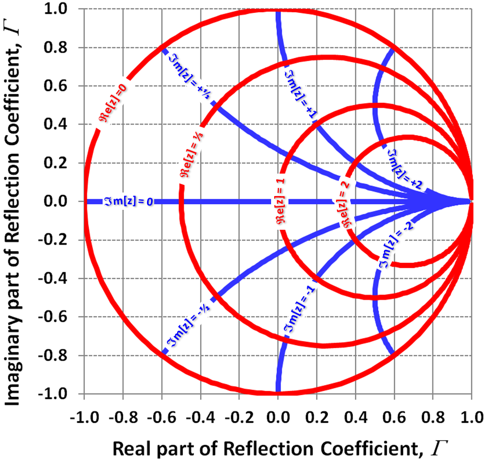

Hãy tưởng tượng lần đầu tiên bạn nhìn thấy một tấm bản đồ với vô số vòng tròn chồng lên nhau, những đường cong chằng chịt như lỗ sâu trong phim khoa học viễn tưởng. Trên một số phiên bản, nó còn được ghi hẳn dòng chữ "ma thuật đen". Đó là Smith Chart — biểu đồ đáng sợ nhất trong ngành kỹ thuật điện. Hàng triệu bản in đã được phát hành, nó được tích hợp sâu vào phần mềm hiện đại nhất hiện nay, và nó giải quyết một trong những vấn đề nghịch lý nhất trong kỹ thuật điện: làm sao truyền tải năng lượng qua đường dây mà không bị mất mát do phản xạ.

Thế nhưng câu chuyện đằng sau nó không bắt đầu từ một giáo sư đại học hay một phòng thí nghiệm hàn lâm. Nó bắt đầu từ một kỹ sư trẻ vừa ra trường, nhận công việc đầu tiên tại Bell Labs vào năm 1928, khi ngành điện thoại đang bùng nổ với hơn 65 triệu cuộc gọi mỗi ngày.

## Cuộc gọi vượt đại dương

Phillip H. Smith được giao một nhiệm vụ tưởng chừng đơn giản: gửi tín hiệu radio từ New Jersey đến các trạm thu cách xa hàng nghìn km ở Anh và Argentina. Với một ăng-ten đơn lẻ, tín hiệu tỏa ra khắp bầu trời, chỉ một phần nhỏ năng lượng đến được nơi nhận. Nhưng nếu kết nối nhiều ăng-ten với nhau, sóng có thể kết hợp, triệt tiêu lẫn nhau ở một số hướng và tăng cường ở những hướng khác. Dùng hơn 20 ăng-ten nhỏ ghép thành một dàn định hướng, liên kết bằng hơn 2 km cáp truyền dẫn, Smith có thể tập trung chùm sóng vào khoảng 10 độ, giúp năng lượng tăng gấp 400 lần.

Nhưng khi thử nghiệm, Smith phát hiện một điều kỳ lạ: một phần tín hiệu đang bật ngược trở lại. Sự phản xạ này khiến phần lớn năng lượng không bao giờ chạm tới ăng-ten. Và nếu năng lượng không đến được ăng-ten, tín hiệu sẽ không thể vượt đại dương.

## Vấn đề của sóng đứng

Khác với dòng điện một chiều (DC) quen thuộc — nơi pin cung cấp điện áp ổn định và dòng chảy đều — tín hiệu radio là dòng điện xoay chiều (AC), nơi điện áp và dòng điện liên tục dao động. Hãy tưởng tượng một sợi dây bạn vẫy lên xuống. Sóng truyền dọc theo dây với bước sóng và tần số nhất định. Khi tần số thấp, bước sóng dài, sóng phản xạ từ đầu dây gần như trùng với sóng gốc — không vấn đề gì. Nhưng khi tần số tăng lên, bước sóng ngắn lại, sóng tới và sóng phản xạ bắt đầu giao thoa. Tại một số điểm chúng cộng hưởng, tại điểm khác chúng triệt tiêu, tạo ra một mô hình sóng đứng.

Đối với Smith, tín hiệu ở dải MHz có bước sóng khoảng 30 mét, trong khi đường truyền dài hơn 2 km. Sóng đứng xuất hiện dữ dội. Ở một số điểm trên đường dây, điện áp đỉnh có thể cao gấp đôi điện áp đầu vào — đủ để đốt cháy dây dẫn. Một thí nghiệm tại Imperial College London tái hiện điều này: với thiết lập tương tự Smith, năng lượng nhận được thấp hơn dự kiến tới 4 dB — nghĩa là mất hơn một nửa công suất.

## Trở kháng và bài toán hai chiều

Vấn đề của Smith là một dạng mất phối hợp trở kháng (impedance matching). Tưởng tượng buộc hai sợi dây khác khối lượng với nhau. Khi sóng chạm đến điểm nối, một phần năng lượng phản xạ lại. Chỉ khi hai sợi dây đồng nhất, sóng mới truyền qua hoàn toàn. Trong hệ thống điện, điều tương tự xảy ra khi trở kháng của đường truyền và ăng-ten không khớp.

Nhưng trở kháng không chỉ là điện trở. Trong thế giới AC, còn có điện dung và điện cảm — những thành phần làm lệch pha giữa dòng và áp. Điện trở thuần nằm trên trục hoành, điện cảm đưa pha lên +90 độ, điện dung kéo pha xuống -90 độ. Để mô tả đầy đủ, các kỹ sư dùng số phức: trở kháng Z = R + jX, nơi R là điện trở và X là điện kháng. Đó là định luật Ohm cho mạch AC.

Vấn đề: mỗi đường truyền có một trở kháng đặc tính cố định (thường là 50 ohm thuần trở). Ăng-ten của Smith có trở kháng 12,5 ohm — lệch xa giá trị cần. Thêm điện trở nối tiếp để nâng lên 50 ohm? Không hiệu quả, vì điện trở tiêu tán năng lượng qua nhiệt — chính xác những gì ta muốn tránh. Thêm tụ hay cuộn cảm? Không giải quyết được phần điện trở.

## Phát hiện mang tính cách mạng

Smith nhận ra một điều then chốt: trở kháng trên đường truyền không cố định. Khi sóng tới và sóng phản xạ giao thoa, tỷ lệ điện áp trên dòng điện thay đổi dọc theo đường dây. Nghĩa là ở một điểm nào đó trên dây, phần điện trở có thể khớp với 50 ohm — chỉ còn phần điện kháng cần xử lý, và có thể dùng tụ hoặc cuộn cảm không tổn hao để triệt tiêu.

Vấn đề là tìm điểm đó. Trước Smith, các kỹ sư phải dùng công thức phức tạp và thước trượt — chậm và dễ sai. Smith muốn một hệ thống đồ họa đơn giản, trực quan.

Ông bắt đầu với mặt phẳng phức, nhưng gặp một vấn đề: trở kháng có thể từ 0 (ngắn mạch) đến vô cùng (hở mạch). Làm sao vẽ vô cực lên một tờ giấy hữu hạn?

Ông nhờ đồng nghiệp Ferrell và McRae, và họ tìm ra câu trả lời: phép ánh xạ bảo giác (conformal map). Thay vì biểu diễn trở kháng, họ biểu diễn hệ số phản xạ — tỷ lệ giữa sóng phản xạ và sóng tới. Giá trị này không bao giờ vượt quá 1, vì sóng phản xạ tối đa bằng sóng tới. Vô cực biến mất.

Khi ánh xạ các đường trở kháng hằng số lên mặt phẳng hệ số phản xạ, những đường thẳng đứng trở thành vòng tròn. Đường điện trở càng cao, vòng tròn càng nhỏ và càng lệch về bên phải. Đường điện kháng hằng số trở thành vòng tròn phía trên hoặc dưới trục hoành. Kết quả là một biểu đồ nơi mỗi điểm mang hai thông tin cùng lúc: trở kháng và hệ số phản xạ. Và khi hệ số phản xạ xoay, nó bước dọc theo đường truyền, quét qua mọi trở kháng có thể đo được. Toàn bộ dải giá trị vô hạn bị nhốt gọn trong một vòng tròn duy nhất.

## Ba nhà phát minh, một giải pháp

Smith hoàn thiện biểu đồ vào năm 1937. Cùng năm đó, Tosaku Mizuhashi ở Nhật Bản độc lập tìm ra cách biểu diễn tương tự. Năm 1939, Amiel Volpert ở Liên Xô cũng làm điều tương tự. Ba nhóm, ba quốc gia, không liên lạc với nhau — cùng hội tụ về một giải pháp.

Lúc đầu, biểu đồ của Smith bị từ chối bởi nhiều tạp chí kỹ thuật. Phải mất hai năm, tạp chí Electronics mới chịu đăng. Nhưng Chiến tranh Thế giới thứ hai thay đổi mọi thứ. Trận chiến Đại Tây Dương: tàu ngầm Đức đánh chìm tàu Đồng minh nhanh hơn khả năng thay thế. Trong đêm tối và thời tiết xấu, radar là vũ khí duy nhất phát hiện tàu ngầm nổi trên mặt nước. Phòng thí nghiệm Bức xạ MIT được giao nhiệm vụ xây dựng hệ thống radar vi ba mới. Giữa chiến tranh, không có thời gian thử sai. Biểu đồ Smith được dùng liên tục. Sau chiến tranh, các kỹ sư mang nó theo vào ngành công nghiệp, vào giảng đường đại học và sách giáo khoa. Phiên bản của Mizuhashi và Volpert chỉ phổ biến trong nước, không lan rộng — đó là lý do ngày nay chúng ta gọi nó là Smith chart.

## Ứng dụng: Khi một đoạn dây chết giải quyết mọi vấn đề

Trong thực hành, một trong những ứng dụng đẹp nhất của Smith chart là dùng "stub" — một nhánh phụ của cáp truyền dẫn, một đầu hở hoặc ngắn mạch. Hãy nghĩ như một nhánh sông nhỏ: nước chảy vào, đập vào tường cuối rồi chảy ra. Chiều dài của nhánh quyết định thời điểm nước quay trở lại. Nếu căn chỉnh đúng, stub tạo ra một điện kháng chính xác để triệt tiêu phần ảo của trở kháng — không dùng điện trở, không tổn hao năng lượng.

Trong thí nghiệm tại Imperial College, sau khi đo trở kháng 36 + j74 ohm, nhóm nghiên cứu dùng Smith chart tính toán: cần thêm một đoạn dây dài 77 mm dạng stub hở mạch. Kết quả? Phản xạ biến mất. Công suất truyền tải tăng vọt. Chỉ bằng một đoạn dây treo lơ lửng, không kết nối với bất cứ thứ gì, được cắt đúng chiều dài — bản thân nó là một phần của thứ nó đang sửa.

## Vượt thời gian

Ngày nay, máy tính có thể tính toán phối hợp trở kháng nhanh hơn bất kỳ con người nào. Nhưng Smith chart vẫn được giảng dạy trong các lớp kỹ thuật điện trên khắp thế giới. Bởi vì máy tính cho bạn đáp số, nhưng nó không cho bạn trực giác về hướng đi. Smith chart là một tấm bản đồ — giống như bạn hỏi đường đến ga tàu điện ngầm gần nhất và ai đó vẽ nhanh lên phong bì: đi thẳng, rẽ trái, thêm một đoạn nữa. Nó dẫn đường cho kỹ sư từ điểm A (hệ số phản xạ 0.68, mất nửa công suất) đến điểm B (tâm biểu đồ, phản xạ bằng không).

Nó khiến ta nhớ đến Mendeleev với bảng tuần hoàn, hay Feynman với giản đồ của ông. Smith chart thuộc về cùng dòng đó — không phải một khám phá mới, mà một cách biểu diễn mới. Và tiến bộ khoa học, hơn tất thảy, thường đến từ những cách nhìn mới về những thứ đã tồn tại.

Biểu đồ đáng sợ nhất ngành kỹ thuật điện. Nhưng cũng là một trong những thứ hữu dụng nhất. Và câu chuyện của nó nhắc nhở chúng ta rằng đôi khi vẻ đẹp nằm ở nơi ít ai dám nhìn.
