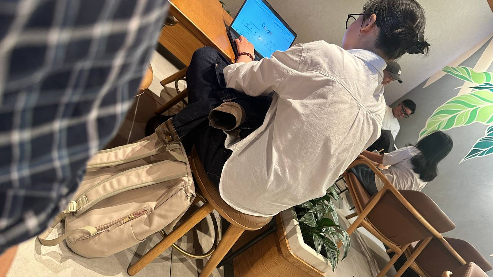

Cuối tuần rảnh rỗi, tìm một quán cafe ngồi chill, làm việc hay tụ tập bạn bè luôn là lựa chọn hàng đầu ở Sài Gòn. Sài thành có hàng trăm quán cafe mọc lên mỗi năm, từ phong cách tối giản, sân vườn, rooftop cho đến concept "cà phê trên giường" độc đáo. Dưới đây là 10 quán cafe đẹp và đáng thử nhất, được chọn lọc dựa trên không gian, chất lượng đồ uống và trải nghiệm thực tế.

## 1. The Workshop Coffee

| Hạng mục | Chi tiết |
|----------|---------|
| Địa chỉ | 27 Ngô Đức Kế, Bến Nghé, Quận 1 |
| Giờ mở cửa | 08:00 – 20:30 (hàng ngày) |
| Giá tham khảo | 20.000đ – 80.000đ |
| Google Maps | 4.5 ⭐ (3.400+ đánh giá) |

The Workshop Coffee nằm trên tầng 2 của một toà nhà mặt tiền đường Ngô Đức Kế, ngay trung tâm Quận 1. Không gian quán rộng rãi với trần cao, cửa sổ lớn đón ánh sáng tự nhiên, bàn ghế gỗ ấm cúng. Điểm đặc biệt nhất của The Workshop là quán **không bật nhạc** — thay vào đó là âm thanh máy pha cà phê, tiếng gõ bàn phím và tiếng trò chuyện nhẹ nhàng, tạo một vibe tập trung rất riêng.

Menu đồ uống đa dạng với các món cà phê specialty như V60, pour-over, cold brew, và salt coffee — món signature được nhiều khách yêu thích. Quán cũng phục vụ bữa sáng và đồ ăn nhẹ. Có nhiều ổ cắm điện và wifi mạnh, thích hợp cho dân remote work.

## 2. L'Usine

| Hạng mục | Chi tiết |
|----------|---------|
| Địa chỉ | 19 Lê Thánh Tôn, Bến Nghé, Quận 1 |
| Giờ mở cửa | 07:30 – 21:30 (hàng ngày) |
| Giá tham khảo | 100.000đ – 300.000đ |
| Google Maps | 4.6 ⭐ (3.200+ đánh giá) |

L'Usine là một trong những quán cafe phong cách Pháp Đông Dương nổi tiếng nhất Sài Gòn. Quán nằm khuất phía sau một cửa hàng thời trang — bạn phải đi xuyên qua shop để vào khu vực cafe. Không gian thiết kế theo phong cách Pháp cổ điển với cửa sổ plantation shutters, ghế Breuer bọc da, gạch men màu xanh ngẫu nhiên và tranh nghệ thuật trên tường.

L'Usine nổi tiếng với các món brunch phương Tây: eggs benedict, brioche French toast, ricotta pancakes, salmon rösti. Đồ uống signature là flat white và caramel coffee. Ngoài ra còn có khu shop bán quần áo và đồ thiết kế. Giá hơi cao nhưng chất lượng đồ uống và món ăn xứng đáng. Thích hợp cho brunch cuối tuần hoặc hẹn hò.

## 3. Du Miên Garden Cafe

| Hạng mục | Chi tiết |
|----------|---------|
| Địa chỉ | 7 Phan Văn Trị, Phường 10, Gò Vấp |
| Giờ mở cửa | 07:00 – 23:00 (hàng ngày) |
| Giá tham khảo | 40.000đ – 88.000đ |
| Google Maps | 4.1 ⭐ (59+ đánh giá) |

Du Miên Garden Cafe là một khu vườn rộng đến 6.000m² với cây xanh cổ thụ, hồ nước nhân tạo, thác nước róc rách và những cabin gỗ tròn độc đáo. Không gian được thiết kế theo phong cách châu Âu kết hợp thiên nhiên, tạo cảm giác như lạc vào một khu vườn cổ tích giữa lòng thành phố.

Menu đa dạng từ cà phê, trà, sinh tố, nước ép đến các món ăn sáng và ăn vặt. Giá cả phải chăng so với không gian. Quán có khu vui chơi trẻ em, thích hợp cho gia đình có trẻ nhỏ hoặc nhóm bạn đi chụp ảnh sống ảo. Lưu ý: quán khá đông vào cuối tuần.

## 4. Cú Trên Cây Coffee

| Hạng mục | Chi tiết |
|----------|---------|
| Địa chỉ | 262 Ung Văn Khiêm, P.25, Bình Thạnh |
| Giờ mở cửa | 08:00 – 22:00 (hàng ngày) |
| Giá tham khảo | 30.000đ – 95.000đ |
| Google Maps | 4.3 ⭐ (2.000+ đánh giá) |

Cú Trên Cây Coffee là một khu vườn nhiệt đới thu nhỏ ngay mặt tiền đường Ung Văn Khiêm. Quán được bao phủ bởi cây xanh từ ngoài vào trong, mang đậm chất Đà Lạt giữa lòng Sài Gòn. Không gian gồm khu vườn ngoài trời, khu trong nhà máy lạnh và tầng trên.

Quán sử dụng cà phê Cầu Đất Đà Lạt — hương vị đậm đà quen thuộc. Menu có bạc sỉu, cà phê cacao sữa, sinh tố trái cây. Ngoài ra còn có một bé thỏ làm mascot trong quán. Không gian yên tĩnh, thích hợp đọc sách hoặc làm việc (có wifi và ổ cắm). Tuy nhiên một số review cho rằng thái độ nhân viên chưa thân thiện lắm.

## 5. Chidori Coffee in Bed

| Hạng mục | Chi tiết |
|----------|---------|
| Địa chỉ | 11 chi nhánh tại TP.HCM (Phú Nhuận, Tân Bình, Bình Thạnh, Tân Phú...) |
| Giờ mở cửa | 08:00 – 23:00 (hàng ngày) |
| Giá tham khảo | 40.000đ – 150.000đ (combo: 80.000đ – 350.000đ) |
| Google Maps | 4.3 ⭐ (trung bình các chi nhánh) |

Chidori Coffee in Bed mang concept "cà phê trên giường" độc đáo từ Nhật Bản. Mỗi chi nhánh có các phòng mini riêng tư được trang bị giường, nệm, gối, bàn làm việc và đèn, tạo không gian ấm cúng như ở nhà.

Quán có các combo dịch vụ linh hoạt: Little Recharge (80.000đ — 1 giờ + 1 nước), Take a Break (160.000đ — 2 giờ + 2 món), Mini Staycation (240.000đ — 5 giờ + 2 nước + 1 bánh), One Day Getaway (350.000đ — 8 giờ + 2 nước + 1 món ăn + 1 bánh). Đồ uống gồm cà phê, trà Nhật (matcha, hojicha, sencha), trà sữa trân châu Nhật Bản và crepe. Wifi miễn phí, có chỗ để xe. Nên đặt trước vào cuối tuần vì rất đông.

## 6. Oromia Coffee & Lounge

| Hạng mục | Chi tiết |
|----------|---------|
| Địa chỉ | 85 Phan Kế Bính, Đa Kao, Quận 1 |
| Giờ mở cửa | 07:00 – 23:00 (hàng ngày) |
| Giá tham khảo | 45.000đ – 110.000đ |
| Google Maps | 3.9 ⭐ (750+ đánh giá) |

Oromia Coffee & Lounge nằm trong một biệt thự cổ với không gian sân vườn xanh mướt, hồ cá Koi và tượng Phật — tạo cảm giác thanh tịnh ngay từ lối vào. Thiết kế phong cách châu Âu cổ điển kết hợp ánh sáng tự nhiên, mỗi góc quán đều có thể trở thành background sống ảo.

Menu đa dạng từ cà phê cốt dừa (signature), espresso đá xay, trà đào hạt chia, mojito chanh dây đến các món Á Âu. Có bánh brownie ấm và đồ ăn nhẹ. Giá từ 45.000đ — khá hợp lý. Quán có tượng các con vật (chim, vịt) trang trí, có mèo cưng. Vào cuối tuần thường đông — nên đặt bàn trước. Một số lưu ý: quán không có chỗ đậu ô tô và khu vực ngoài trời có thể hơi nóng vào buổi trưa.

## 7. Trên Tầng Thượng

| Hạng mục | Chi tiết |
|----------|---------|
| Địa chỉ | 540/19 Cách Mạng Tháng 8, P.11, Quận 3 |
| Giờ mở cửa | 07:30 – 22:30 (hàng ngày) |
| Giá tham khảo | 60.000đ – 200.000đ |
| Google Maps | 4.9 ⭐ (169+ đánh giá) |

Trên Tầng Thượng nằm trên sân thượng của một nhà máy cũ với diện tích hơn 1.000m², mang phong cách Đà Lạt giữa lòng Sài Gòn. Chất liệu gỗ thông, ngói, gạch men cũ và cây cỏ tạo nên một không gian gần gũi thiên nhiên.

Từ đây có thể ngắm nhìn đoàn tàu lửa của xí nghiệp bảo dưỡng tàu phía dưới. Vào chiều tối, hoàng hôn nhuộm vàng cả không gian — thời điểm đẹp nhất để chụp ảnh. Menu có cà phê, trà sữa, nước ép, sinh tố, cocktail và bánh ngọt. Quán cũng có dịch vụ BBQ vào buổi tối. Lưu ý: lên bằng cầu thang xoắn ốc, và vào buổi trưa trời khá nóng. Thời điểm lý tưởng là 16h00 – 18h00.

## 8. Lạc Concept

| Hạng mục | Chi tiết |
|----------|---------|
| Địa chỉ | 120/25 Trần Bình Trọng, Phường 2, Quận 5 |
| Giờ mở cửa | 09:00 – 22:00 (hàng ngày) |
| Giá tham khảo | 35.000đ – 65.000đ |
| Google Maps | 4.5 ⭐ (500+ đánh giá) |

Lạc Concept là một studio kết hợp cafe theo phong cách Nhật Bản tối giản. Không gian được thiết kế với tông màu trắng, gỗ và cây xanh, ánh sáng tự nhiên tràn ngập. Quán bán "vé vào cổng" thông qua việc order nước — nếu không order nước sẽ bị thu phí 50.000đ/người.

Menu đồ uống Nhật Bản từ 35.000đ – 65.000đ. Quán cũng phục vụ đồ ăn vặt Nhật như takoyaki (bánh bạch tuộc) và taiyaki (bánh cá nướng nhân đậu đỏ) giá từ 15.000đ – 45.000đ. Chụp ảnh kỷ niệm không tính phí, nhưng chụp với mục đích thương mại hoặc cosplay sẽ thu phí 100.000đ. Không gian yên tĩnh, thích hợp đọc sách hoặc làm việc.

## 9. Sài Gòn Ơi Cafe

| Hạng mục | Chi tiết |
|----------|---------|
| Địa chỉ | Lầu 5, 42 Nguyễn Huệ, Bến Nghé, Quận 1 |
| Giờ mở cửa | 07:00 – 22:00 (hàng ngày) |
| Giá tham khảo | 40.000đ – 100.000đ |
| Google Maps | 4.2 ⭐ (590+ đánh giá) |

Sài Gòn Ơi Cafe nằm trên tầng 5 của chung cư 42 Nguyễn Huệ — toà chung cư cafe nổi tiếng ngay phố đi bộ Nguyễn Huệ. Không gian phong cách Scandinavian tối giản với tông màu sáng, nhiều cây xanh và ban công thoáng đãng nhìn ra phố đi bộ.

Menu sáng tạo với các món đặc biệt như cà phê sầu riêng (Durian Coffee) — món signature gây tò mò, cùng các loại trà, sinh tố, bánh ngọt. Có cơm tấm và đồ ăn nhẹ. Giá cả phải chăng, view đẹp, thích hợp để làm việc hoặc tụ tập bạn bè. Lưu ý: quán nằm trong chung cư cũ, thang máy có thể đông vào giờ cao điểm.

## 10. Blank Lounge Landmark 81

| Hạng mục | Chi tiết |
|----------|---------|
| Địa chỉ | Tầng 75-76, Landmark 81, 208 Nguyễn Hữu Cảnh, Bình Thạnh |
| Giờ mở cửa | 09:30 – 23:30 (hàng ngày) |
| Giá tham khảo | 90.000đ – 350.000đ |
| Google Maps | 4.5 ⭐ (1.800+ đánh giá) |

Blank Lounge là sky lounge cao nhất Việt Nam, tọa lạc tại tầng 75-76 của Landmark 81. Từ đây, bạn có thể ngắm toàn cảnh Sài Gòn từ trên cao với tầm nhìn 360° xuyên suốt từ ban ngày sang đêm. Thiết kế hiện đại, sang trọng với tường kính trong suốt bao quanh.

Menu đa dạng từ cà phê (90.000đ – 150.000đ), trà (80.000đ – 130.000đ) đến cocktail signature như Skyline Martini, Ho Chi Minh Sunset (200.000đ – 350.000đ). Có bánh ngọt, share platters và đồ ăn nhẹ. Mẹo: thay vì mua vé Skydeck (460.000đ), bạn chỉ cần gọi một ly nước tại Blank Lounge là đã có thể ngắm toàn cảnh thành phố. Thời điểm vàng: 16h30 – 17h00 để ngắm hoàng hôn. Nên đặt bàn trước qua website.
