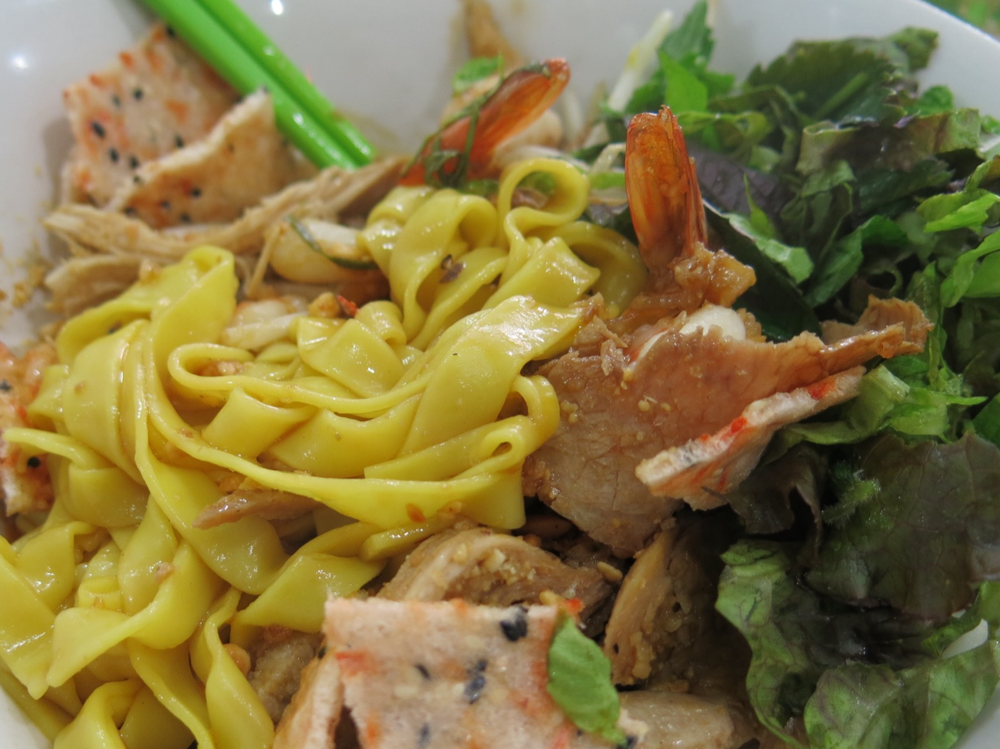

Có những món ăn mang theo cả quê hương trong từng sợi mì. Với người con xứ Quảng rời Đà Nẵng, Quảng Nam vào Sài Gòn lập nghiệp, nỗi nhớ đầu tiên hiếm khi là nhà cửa hay bạn bè — mà là một tô mì Quảng. Sợi mì vàng dai mềm, tô nước nhưn sánh xâm xấp đầy tay, vài lát thịt, con tôm, miếng cá lóc kho hổ phách, thêm đĩa rau sống và bánh tráng mè giòn tan. Khác với phở ngập nước dùng hay bún bò Huế đậm màu, mì Quảng là món ăn của sự cân bằng: khô ráo mà vẫn đậm đà, mộc mạc mà không kém phần kỳ công.

Sài Gòn không thiếu quán mì Quảng — hàng trăm quán trải từ vỉa hè Bảy Hiền đến mặt tiền quận 1. Nhưng tìm được tô mì "chuẩn Quảng" giữa lòng thành phố thì không dễ. Dưới đây là 10 cái tên được thực khách và báo chí nhắc đến nhiều nhất năm 2026, kèm địa chỉ, giá và giờ mở cửa để bạn ghé đúng lúc.

## Mì Quảng Sâm — Quán mì Quảng hơn 30 năm ở Bảy Hiền

Ít quán nào ở Sài Gòn có hành trình dài như Mì Quảng Sâm. Báo Tuổi Trẻ từng viết về quán với câu chuyện "từ quán lề đường đến ngày cả ngàn tô": hơn 30 năm trước, quán khởi đầu ở góc vỉa hè khu Bảy Hiền, rồi dời vào nhà trên đường Võ Thành Trang, và giờ đây nằm trên đường Ca Văn Thỉnh (quận Tân Bình) — địa chỉ 16 Ca Văn Thỉnh, phường Bảy Hiền. Chủ quán là anh Võ Văn Sâm, người gần như ngày nào cũng có mặt bên nồi nước nhưn.

Điểm đáng chú ý là cách quán giữ trọn nghi thức của một bát mì Quảng truyền thống: tô thường 43.000 đồng đã bao gồm 1/4 bánh tráng, khăn lạnh, trà nóng và giữ xe miễn phí — thứ khó lòng tìm được ở quán nào khác. Tô gà sườn lớn có giá 55.000 đồng, no căng bụng. Chất lượng ổn định suốt ba thập kỷ khiến nơi đây vẫn là một trong những quán mì Quảng đông khách nhất khu Bảy Hiền đến tận hôm nay. Điểm trừ duy nhất là giờ cao điểm trưa quán rất đông, bạn nên đến sớm.

## Mì Quảng Bà Mua — Thương hiệu Duy Xuyên 1979 vừa "Nam tiến"

Nếu muốn thử mì Quảng từ một thương hiệu có tuổi đời gần nửa thế kỷ, Mì Quảng Bà Mua là cái tên đáng nói nhất. Thương hiệu ra đời năm 1979 tại Duy Hoà, Duy Xuyên (Quảng Nam) và từng được tờ The New York Times cùng các kênh truyền hình ẩm thực Nhật Bản, Hàn Quốc, châu Âu khen ngợi. Năm 2020, các con của bà Mua mở chi nhánh đầu tiên tại Sài Gòn, và hiện hệ thống đã có sáu địa điểm ở thành phố.

Chi nhánh gần sân bay nhất là 80A Yên Thế, phường 2, quận Tân Bình — rất tiện cho chuyến bay về đến đất Sài Gòn mà đã thèm một tô mì. Các cơ sở khác gồm 196 Bàu Cát (Tân Bình), 03 Nguyễn Sơn (Tân Phú), 04 Hoàng Kế Viêm (Tân Bình), 60A Lê Thị Riêng (quận 1) và một chi nhánh trên đường Lê Văn Thọ (Gò Vấp). Điều thú vị là bà Mua, dù đã lớn tuổi, vẫn trực tiếp đứng bếp chính cho cả hệ thống. Không gian quán được thiết kế theo phong cách Hội An với những góc gợi nhớ quê hương, và phương ngữ xứ Quảng được viết ngay trên menu — đủ để người con xa quê cảm thấy thân thuộc.

## Mì Quảng 3 Anh Em — Mì cá lóc và nguyên liệu từ quê ra

Mì Quảng 3 Anh Em được chính chủ quán, anh Tú, giải thích nguyên tắc của mình trong một bài giới thiệu: "Đúng chất Quảng là phải tráng thủ công mì hai lớp từ loại gạo đặc trưng, phải dùng dầu phộng, củ nén, ớt xanh Điện Bàn, bánh tráng nướng than chuyển từ quê vào Sài Gòn". Hệ thống hiện có ba chi nhánh: 117 D2, phường 25, quận Bình Thạnh; 304 Lê Văn Sỹ, phường 1, quận Tân Bình; và 193 Cách Mạng Tháng 8, phường 4, quận 3.

Điểm nhấn của quán là tô mì Quảng cá lóc với miếng cá kho màu hổ phách đẹp mắt, thịt dai thơm, cùng món gà chọi rút xương hiếm quán nào có. Nước nhưn chỉ xâm xấp tay mì — đúng chuẩn món này, khác hẳn các quán "lai" với nước lõng bõng. Một lưu ý trung thực: trước đây quán nhập rau từ Hội An, nhưng chi phí quá cao nên giờ đĩa rau phải "made in Sài Gòn" — tín đồ khó tính của rau xứ Quảng nên biết điều này. Giá dao động 45.000 – 70.000 đồng, và theo các bài review năm 2026, chi nhánh Cách Mạng Tháng 8 còn tặng trà đá miễn phí.

## Mì Quảng 85 Trần Quang Diệu — Quán chỉ bán đến trưa

Trên đường Trần Quang Diệu (quận 3), ngay cạnh con kênh Nhiêu Lộc, có một quán mì Quảng nằm dưới chân chung cư cũ mà người Sài Gòn chỉ gọi tắt: Mì Quảng 85. Quán mở từ 6 giờ sáng đến 12 giờ 30 mỗi ngày — hết giờ là đóng cửa, nên đây là lựa chọn đúng nghĩa cho bữa sáng, kể cả với những người muốn bắt đầu ngày mới muộn hơn chút.

Tô mì ở đây nổi tiếng với nước dùng đậm đà sánh quánh, topping thịt heo, tôm, trứng đầy ụ, kèm bánh tráng mè giòn — thứ mà du khách quốc tế viết review không quên nhắc đến. Các bài đánh giá trong năm 2026 ghi nhận mức giá 35.000 – 55.000 đồng một tô. Nhược điểm dễ thấy nhất là quán nhỏ, chỗ ngồi chủ yếu ngoài trời và có vài bậc thang ở lối vào, không thuận tiện cho người khó khăn khi di chuyển.

## Mì Quảng Mỹ Sơn — Ngay trung tâm quận 1

Giữa khu Đa Kao sầm uất, Mì Quảng Mỹ Sơn ở 38B Đinh Tiên Hoàng, phường Đa Kao, quận 1 là địa chỉ dễ tìm nhất cho ai muốn ăn mì Quảng mà không phải rời trung tâm. Quán mở từ 6 giờ 30 sáng đến 10 giờ tối, phù hợp cho cả bữa sáng vội, bữa trưa văn phòng lẫn bữa khuya.

Thực đơn xoay quanh những phiên bản quen thuộc: mì Quảng tôm, thịt, và tô đặc biệt với đầy đủ topping. Giá tham khảo 35.000 – 55.000 đồng, mức trung bình của khu vực trung tâm. Quán nhận được khoảng 3,9/5 sao trên Google Maps — không phải điểm cao nhất danh sách này, nhưng vị trí và giờ mở cửa dài khiến nó trở thành lựa chọn thực dụng cho người làm việc quanh quận 1.

## Mì Quảng Ăn Là Nhớ — Nêm nếm đậm đà giữa quận 3

Mì Quảng Ăn Là Nhớ tại 123 Trần Quốc Thảo, phường 7, quận 3 là cái tên lâu năm được nhắc đến trong hầu hết các danh sách mì Quảng ở Sài Gòn. Tô mì ở đây nổi tiếng với độ đậm đà: sợi mì dai, nước nhưn nêm nếm vừa miệng, topping tôm, thịt, sườn phong phú. Quán mở 7 giờ sáng đến 10 giờ 30 tối, giá 40.000 – 66.000 đồng.

Tuy nhiên, một sự trung thực cần thiết: các đánh giá gần đây cho thấy ý kiến thực khách chia làm hai nửa. Một phần khen hương vị và vị trí thuận tiện, phần khác phàn nàn về chất lượng không ổn định và thái độ phục vụ thay đổi theo giờ đông khách. Nếu bạn muốn trải nghiệm ở "phong độ" tốt nhất của quán, hãy ghé vào giờ thấp điểm giữa buổi sáng.

## Mì Quảng Cô Ba — Sợi mì handmade trên đường Trần Hưng Đạo

Nằm ở 67 Trần Hưng Đạo, phường 10, quận 5, Mì Quảng Cô Ba là lựa chọn được giới trẻ yêu thích nhờ không gian nhỏ gọn, ấm cúng — phù hợp cho bữa trưa nhanh hoặc bữa tối nhẹ. Điểm nhấn được nhắc đến nhiều nhất là sợi mì làm thủ công, kết hợp với nước dùng thanh nhẹ, không quá nặng vị.

Giá ở đây từ 35.000 đến 65.000 đồng, giờ mở cửa 7 giờ sáng đến 9 giờ tối. Nếu bạn ở quận 5, 6 hay Chợ Lớn, đây là quãng đường di chuyển hợp lý nhất trong danh sách này.

## Tiệm Mì Đúng Quảng — Tô đặc biệt ba loại nhân ở Tô Hiến Thành

Tiệm Mì Đúng Quảng ở 350 Tô Hiến Thành, phường 14, quận 10 có một cái tên "tuyên ngôn" hiếm thấy, và thực đơn cũng gọn gàng theo cách ấy: mì Quảng gà ta, ba rọi, tôm, trứng — mỗi tô 45.000 đồng — và tô đặc biệt gồm ba loại nhân với giá 55.000 đồng. Quán mở từ 9 giờ sáng đến 10 giờ tối.

Điểm cộng của tiệm là không gian mát mẻ, sạch sẽ giữa lòng quận 10, thích hợp cho bữa trưa vừa ăn vừa tránh nóng. Một chi tiết đáng biết: buổi tối quán còn phục vụ lẩu gà, nên nếu muốn một bữa tối đổi món từ mì Quảng sang lẩu, bạn có thể nán lại.

## Mì Quảng Lê Thương — Quán mì Quảng nổi tiếng ở Gò Vấp

Với người ở Gò Vấp, Mì Quảng Lê Thương ở 111 Đường Số 8, phường 11 là cái tên quen thuộc. Quán mở từ 6 giờ sáng đến 9 giờ tối, và các bài review năm 2026 ghi nhận mức giá quanh 42.000 – 60.000 đồng. Món đặc trưng là tô đặc biệt với chả cua, thịt, trứng cút và tôm, ăn kèm bánh tráng giòn và đĩa rau sống gồm húng quế, xà lách, giá đỗ.

Điểm được thực khách đánh giá cao là tốc độ lên món — kể cả lúc quán đông — và phong cách phục vụ thân thiện. Quán hỗ trợ mua mang đi, nên nếu bạn ngại chờ đợi giờ trưa văn phòng, gọi mang về cũng là lựa chọn hợp lý. Trên Google Maps, quán giữ mức 4,3/5 sao.

## Mì Quảng Nam Sơn — Không gian sạch sẽ, ý kiến trái chiều

Khép lại danh sách là Mì Quảng Nam Sơn tại 21 Lê Đức Thọ, phường 7, quận Gò Vấp. Quán được chú ý nhờ không gian sạch sẽ, lịch sự và có đầu tư, với giá 40.000 – 60.000 đồng một tô và mức đánh giá 4,2/5 sao trên Google Maps. Đây là lựa chọn phù hợp nếu bạn ưu tiên chỗ ngồi thoải mái hơn là quán vỉa hè.

Điều cần biết trước khi ghé: ý kiến thực khách về quán khá trái chiều. Một số đánh giá cho rằng giá hơi cao so với lượng đồ ăn — ít mì, ít thịt — trong khi số khác thấy xứng đáng với chất lượng và không gian. Lời khuyên chung từ các bài review: cân nhắc gọi thêm topping nếu bạn thích ăn "đầy ụ".

## Lựa chọn của bạn là gì?

Mì Quảng là món ăn của sự kiên nhẫn: sợi mì tráng thủ công, nước nhưn ninh nhỏ lửa, bánh tráng nướng than — mỗi công đoạn đều là tiếng vọng của miền Trung giữa lòng Sài Gòn. Danh sách trên không có thứ hạng tuyệt đối; mỗi quán một cá tính, từ Mì Quảng Sâm chuẩn vị vỉa hè xưa đến Mì Quảng Bà Mua theo triết lý thương hiệu, từ Mì Quảng 85 chỉ mở đến trưa cho đến Tiệm Mì Đúng Quảng mở đến tối. Hãy bắt đầu từ quán gần bạn nhất, và nhớ ghé sớm ở những quán chỉ phục vụ buổi sáng.

Lưu ý giá cả có thể thay đổi theo thời điểm; các mức giá trong bài được tổng hợp từ báo chí và bài review trong năm 2025–2026. Nếu hành trình ẩm thực Sài Gòn của bạn chưa dừng lại, đừng bỏ qua [top quán phở ngon nhất Sài Gòn](), [bún bò Huế đậm đà]() hay [cà phê vỉa hè sáng sớm]() — mỗi món một câu chuyện riêng của thành phố này.
